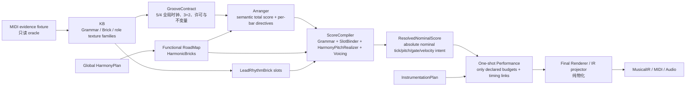

# Jazz 5/4 随机生成抽象任务书

状态：首个生成闭环与机器门禁已完成，等待分层人工审听（2026-07-20）

任务代号：`J54-GENERATIVE-V1`

当前范围：按本文门禁分阶段修改生成引擎；任何后续音乐性工作不得绕过 Gate G。

> 执行修订：原 Batch 编号保留为知识域索引，但不再作为实施顺序。正式执行顺序为
> `Oracle → Score/TimingLink/Provenance seam → canonical Bass/Comp/Drum → reference-zero Performance + pure projector → production Gate G → Harmony/Form → Lead → generative variants`。
> Gate G 依赖的最小 KB、ScoreCompiler seam 和 pure projector 必须先完成，不能等待原 Batch 3–5。

> 2026-07-20 实施快照：product `jazz_5_4_modern_piano` 已接通独立 33-bar form、
> Arranger `LeadPhraseDirective` 与逐小节 `JazzFiveFourEnsembleScore`、六类 Lead Grammar、
> 30-cell SlotBinder、nominal Harmony lookup、MG pitch realizer、Bass/Comp/Drum ScoreCompiler、
> score-owned Lead residual，以及 all-role pure FinalIR projection。128 个 seed 已逐个通过 Score
> validation、Gate G、Gate L 和最终 IR/Score 事件恒等验证；4/4 control 不进入该路径。
>
> 可试听验收包：`tmp/jazz-five-four-generative/seed-1662/`。其中 `score-log.json`
> 包含全部 743 个音符/鼓点的 nominal/performed tick、bar/beat、pitch、Harmony intent 与
> provenance；`full.mid`、各角色 stem、click 和 `full.wav` 已生成。当前剩余的是用户分层
> 人工审听，以及后续把单一 33-bar 原型扩成更多 form 组合；这两项不影响当前首版闭环的架构边界。

## 1. 最终目标

把 `Take-Five-1.mid` 中可复用的 5/4 音乐知识拆成：

- `GrooveContract`：统一全曲数学时钟、3+2 分组、合法相位与跨轨关系。
- `KB`：保存 Lead Grammar、Rhythm Brick、Bass/Comp/Drum 织体词汇和有证据的变体。
- `Arranger`：按全曲结构选择角色、织体、变体、重复、变奏、交接，并写出逐小节总谱。
- `Harmony / HarmonicBrick`：提供全局和声路线；Lead、Bass、Comp 都按 nominal absolute time 读取同一个和声事实。
- `ScoreCompiler`：把 Arranger directive、LeadRhythmBrick、Grammar 和 Harmony 编译成 resolved nominal score。
- `Renderer`：只投影已经 resolved/performed 的总谱，不再猜风格、补拍、删拍或选择变体。

目标不是把 MIDI 的整首音符硬编码进产品，而是先让一个确定性的 reference score 在节拍上与 MIDI 对齐，再用同一套抽象随机生成同类 5/4 Jazz。

## 2. 不可违反的设计结论

1. Bass、Comp、Lead 是低、中、高三个功能声部，乐器选择与声部逻辑分离。
2. `Follow GrooveContract` 的含义是共享全局时钟和互锁约束，不是三轨使用同一套起音 mask。
3. Groove 的 nominal timing 与 performance timing 必须分层且各只有一个所有者；MIDI 已写进 rational cell 的 authored pocket，其 reference residual 必须为 0，不得再次 swing 或 humanize。
4. Lead 必须走 `HarmonicBrick + LeadRhythmBrick -> Grammar/SlotBinder -> HarmonyPitchRealizer` 主链，不创建平行的固定旋律生成器。
5. `HarmonicBrick` 是现有 FunctionalRoadMap 的和声功能块；`LeadRhythmBrick` 是新增的节奏槽模板。两者不是同一种 Brick，不得混用类型或职责。
6. LeadRhythmBrick 只保存节奏骨架、休止、重音、轮廓意图和变奏预算，禁止保存固定旋律音高或逐槽固定音程链。
7. Bass/Comp 的变体按整个 cell、整小节或整乐句选择，禁止 Renderer 对每个 hit 做独立伯努利删除。
8. Arranger 是总谱指挥：负责 form、active roles、foundation owner、phrase pattern、variant 和跨轨 cue。
9. Grammar 抽样、节奏槽绑定、和声音高实现和 voicing resolution 必须在 final Renderer 前完成；Renderer 不得出现 `if JAZZ && 5/4 && sectionName...` 一类风格决策。
10. MIDI 中 Piano 与 Acoustic Bass 长时间共存，并没有 Bass→Comp 的原始交接。`Bass + Lead -> Comp + Lead` 是我们的 Arranger 编配方案，必须明确标注为设计选择，不能伪装成 MIDI 事实。
11. 当前固定 5/4 实现只能降级为 reference/golden control；不得继续作为产品生成逻辑反复打补丁。

## 3. MIDI 证据基线

| 项目 | 证据 |
| --- | --- |
| 文件身份 | SHA-256 `2af0225ca50206087922b71ca81382f37f349e79259859c4b2b7911b673473d1` |
| 格式 | SMF 0，单轨，多 MIDI channel |
| 源 PPQ | 192 |
| Tempo | 167.000203 BPM |
| 拍号 | 文件没有 time-signature meta；由 960 tick 稳定周期推断为 5/4 |
| 分组 | 3+2；组边界在源 tick 576 |
| 全局内容原点 | 源 tick 960；此前是一小节公共 preroll |
| 引擎 PPQ | 480 |
| 引擎小节长度 | 2400 ticks |
| 引擎 3+2 边界 | 1440 ticks |
| 音符总数 | 4966 |
| Drum | 1884 hits |
| Piano | 2091 notes |
| Acoustic Bass | 525 notes |
| Alto Sax Lead | 466 notes |

源 tick 960 只允许在导入 oracle 时统一减一次，映射为引擎全曲原点；禁止 Bass、Comp、Lead、Drum 或 section 各自裁头、各自归零。

### 3.1 核心一小节互锁

引擎 PPQ480 下，Piano A-family 的六个联合相位为：

`[0, 305, 785, 960, 1440, 1920]`

| 功能 | 起音相位 | 说明 |
| --- | --- | --- |
| Piano foundation / keyboard Bass | `[0, 785, 1440]` | 低声部骨架 |
| Upper Comp | `[305, 960, 1920]` | 中声部回答 |
| Acoustic Bass A | `[0, 1440, 1920]` | 独立 Bass family，不等同于 Piano foundation |
| Harmony A slot | `[0, 1440)` / `[1440, 2400)` | 3拍 tonic-minor / 2拍 minor-vamp response |

相位 305 来自 `122/192 = 61/96 = 2/3 - 1/32` beat，比严格 triplet offbeat 提前 15 个引擎 tick，约 11.23ms。这是 authored cell，不是随机误差。

核心 Drum 一小节为 12 hits、10 个 distinct onsets：

- Kick：`0`，velocity 94。
- Ride：`[0, 480, 960, 1280, 1440, 1760, 1920]`，velocity `[92, 92, 92, 77, 88, 69, 105]`。
- Snare：`[800, 1440, 2080, 2240]`，velocity `[67, 67, 33, 63]`。
- 所有核心 drum trigger duration 为 10 engine ticks。

这说明 5/4 的推动感来自跨轨错位和回答关系，不是只在第 1、4 拍一起重击。

### 3.2 Bass/Comp 变体证据

- Piano A-family 共 162 小节：157 小节是完全相同的 base，4 小节只做全层 velocity ×约 0.70 的 breakdown，1 小节是 phrase-final fill。
- Piano B/bridge 共 16 小节，是两个完全相同的 8-bar phrase。前 7 小节整格省略 960；第 8 小节 turnaround 整格省略 1920、恢复 960。
- Acoustic Bass A 的 146 小节使用同一完整 mask；4 小节只降力度，ending 8 小节使用 octave-lift。
- Drum core 有 98 小节连 pattern 和 velocity 都完全相同，占全部非空鼓小节的 53.6%。

因此随机化的正确单位是 phrase-position variant，而不是每小节、每个 hit 各自随机。

### 3.3 Lead 证据摘要

- Lead 总音域 MIDI 54–78。
- 一小节采用 30-cell triplet-sixteenth nominal lattice，每 cell 80 engine ticks。
- Lead 与 Piano 严格同起只有 `15/466 = 3.2%`；Lead 与 Drum canonical 区严格同起约 4.8%。
- Lead 必须有独立短语语法，只共享全局 bar clock，不能吸附到 Bass、Comp 或 Drum mask。
- 可抽象为 `pickup / headA / headB / solo / coda / intentional-rest` 六个 family。
- Head 的 A/B/A 与 recap 有高比例节奏复用，但结尾和音高允许变奏；不能每小节独立随机。

## 4. 目标数据流与职责



| 层 | 应拥有 | 不应拥有 |
| --- | --- | --- |
| Evidence fixture | 源 hash、PPQ、绝对事件、推断依据、统计 | 产品随机选择 |
| KB | rational phase、semantic action、structural gate/velocity intent、完整变体、可变预算、权重、来源 | section 绝对位置、整首 form |
| GrooveContract | meter、3+2、song-global origin policy、合法 lane、interaction invariants、timing ownership | 源文件的固定 tick960、固定旋律、固定整首段落、某小节具体选哪个变体 |
| Arranger | form、角色启停、foundation owner、per-bar pattern/variant、repeat/mutation、跨轨 cue、timingLinkId | MIDI 音色物化、临时补拍 |
| Harmony / Brick | 全局 chord spans、功能路线、Brick 边界 | 按声部猜和弦 |
| ScoreCompiler | Grammar 抽样、HarmonicBrick/LeadRhythmBrick 槽绑定、nominal onset 和声音高、Bass/Comp voicing | form/variant 重选、performance 抖动 |
| Instrumentation | role→instrument、register、articulation/profile 选择 | 节奏 cell、和声、form |
| Performance | 只在 Score 声明的预算内施加一次 residual/expression；reference budget 为 0；按 timingLink 保持锁点 | 改写 nominal cell、结构 gate、和声或音色选择 |
| Final Renderer | 消费 resolved mapping 与 performed score，投影到 NoteIR/MIDI/audio | Grammar、和声音高实现、voicing、风格判断、变体抽签、二次 swing/humanize |

### 4.1 当前实现与目标的差距

- 已建立独立 Bass/Comp texture family、完整 Drum phrase vocabulary 和 Lead rhythm/grammar KB；选择单位是 whole-bar/whole-phrase，不做逐 hit 伯努利删除。
- `JazzFiveFourEnsembleScore` 已逐小节冻结 active roles、foundation owner、texture variant、Drum phrase placement 和 interaction cue；Bass→Comp 交接是明确的 Arranger 决定。
- `JazzFiveFourScorePlan` 已成为 Harmony/Instrumentation 后、Renderer 前的唯一 5/4 score seam；生成事件必须携带 Arranger、phrase、foundation、interaction 和 material provenance。
- Product Lead 已走 `Grammar -> SlotBinder -> nominal Harmony -> MG pitch realizer`；强拍、3+2 边界和 cadence arrival 的 70% 稳定语义门在 Grammar 有界拒绝采样中完成，不做渲染后修音。
- Final Renderer 对该 archetype 只投影 performed score events；128-seed 测试逐事件比较 Score 与 FinalIR，未发现二次 swing、补拍、删拍或换音。
- 当前仍只有一个 1+8+8+8+8 的首版 form 原型。下一阶段可在保持同一 Score/KB/GrooveContract 接口的前提下扩充 form vocabulary，而不是复制固定音符。

这些现有对象可以作为迁移接口，但不能继续承担固定歌曲事件表的职责。

## 5. 分批实施任务与验收门

所有批次严格串门验收。后面的“好听”不能抵消前面的数学错拍。

## Batch 0：冻结 MIDI Oracle

### 任务

- `J54-E01`：建立只读 source fixture，锁文件 hash、PPQ、tempo、channel/program、note-on/off 与全局内容原点。
- `J54-E02`：建立 source PPQ192 → engine PPQ480 的 rational tick 映射，不先量化到普通八分或三连音网格。
- `J54-E03`：输出逐事件对照报告字段：role、source absolute tick、source bar/phase、engine expected rational tick、projected tick、duration、velocity、pattern family。
- `J54-E04`：把 MIDI 中的事实与我们的编配决定分开标注。例如 Bass→Comp handoff 只能标为 `arranger-authored`。
- `J54-E05`：建立机器可读统计快照；产品运行时不读取用户附件路径，只认衍生 KB 与 source hash。
- `J54-E06`：固定计数口径：全局内容原点之后的音符覆盖 content bar `0..183`，共 184 bars；Drum 连续非空 bar 为 `0..182`，共 183 bars。SMF End-of-Track 不作为 Groove form 长度。

### Gate E：证据门

- 文件 hash、4966 个 paired notes 和四个角色计数完全一致。
- 只存在一个 global origin；任何 role-local 或 section-local reset 测试必须失败。
- 对无法整数映射的 odd source tick，保存 rational expected tick；最终整数投影误差不得超过 0.5 engine tick，且不能累计漂移。
- Oracle 只读，不进入 Runtime renderer。

## Batch 1：先让 Groove 与 MIDI 数学对拍

这是第一优先验收。Gate G 未通过，不进入 Lead 音乐性验收。

### 任务

- `J54-G01`：把 `GrooveContract` 扩展为一个共享时钟契约：5/4、3+2、2400 ticks/bar、1440 group boundary、`barOriginPolicy='song-global'`、authored timing source、`postSwing=false`。源文件 tick960 只属于 Evidence importer，不写进可复用 Contract。
- `J54-G02`：支持多个可寻址的 subdivision/phase lane，而不是单一 swing ratio：quarter、triplet-late 2/3、authored 61/96、development 5/8、straight-sixteenth 1/4、Lead 1/6 beat cell。Contract 只声明坐标词汇；每个 role/section 允许哪些 lane、怎样组成完整 mask，必须由 KB family 和 Arranger score 限制，不能任意散点抽样。
- `J54-G03`：在 Arranger score 中建立逐小节、逐角色的 concrete rhythm score；`GrooveSectionScore.roleRhythmByRole` 的单一 section pattern 不能继续承担全部生成职责。
- `J54-G04`：建立 reference compilation mode，只选择 MIDI 证据中的 canonical patterns，用来证明时钟和互锁正确；它不是产品默认生成模式。
- `J54-G05`：明确 nominal timing 和 performance residual 的字段与 owner。所有已编码成 rational cell 的 exact onset，包括 305 和 785，其 reference residual 恒为 0；只有未编码进 nominal cell、且 Score 明确给出预算的 generative event，才允许在 Performance 层采样一次 residual。
- `J54-G06`：建立 source-vs-engine groove matcher 与 phase histogram，不以听感猜测代替 tick 审计。
- `J54-G07`：输出 groove-only 审听件：click、Drum、Bass、Comp 以及组合版本，先不放 Lead。
- `J54-G08`：为跨轨锁点建立 `timingLinkId`。Exact-lock group 要么共同 residual=0，要么共享同一个 residual；flam pair 共享 residual 并恒定保留相对差值；Lead 不加入节奏组 timing link。
- `J54-G09`：统一 collision 定义：`collisionRate(A->B) = A distinct absolute onsets 中也存在于 B 的数量 / A distinct onsets 数量`，和弦多音只算一个 onset，scope 只取两角色同时 active 的指定 bars。Nominal score 与 performed events 必须分别报告。

### Gate G：Groove/MIDI 对拍验收

必须同时满足：

1. 输出 time signature 为 5/4；reference tempo 为 167.000203 BPM；每小节严格 2400 ticks，3+2 边界严格 1440。
2. 源 tick 960 只统一映射一次；无论 section、handoff、role entry 怎样变化，`absoluteTick % 2400` 不改变。
3. Piano A reference 的 union onset 必须逐项为 `[0,305,785,960,1440,1920]`，误差 0 tick。
4. Piano foundation 必须为 `[0,785,1440]`；Upper Comp 必须为 `[305,960,1920]`；Acoustic Bass A 必须为 `[0,1440,1920]`。
5. Piano foundation reference duration 为 source `[86,60,278]` → engine `[215,150,695]` ticks、velocity 为 `[76,94,90]`。Upper Comp 三次逐声部 duration 分别为 source `[30,16,32]` → engine `[75,40,80]`、source `[46,22,26]` → engine `[115,55,65]`、source `[64,64,66]` → engine `[160,160,165]`，逐声部 velocity 分别为 `[90,68,86]`、`[90,86,68]`、`[72,94,90]`。
6. Acoustic Bass A reference duration 为 `[1170,365,285]` ticks、velocity 为 `[84,65,65]`；三个 articulation gap 分别为 `[270,115,195]` ticks。
7. Drum core 必须是上述 12 hits / 10 onsets，phase、velocity、10-tick trigger duration 逐项一致；reference oracle 的全部 1884 个 Drum note duration 都必须验证为 10 engine ticks。
8. `61/96` authored phase 必须保留为 305，不得被重摆到 320；reference timing humanizer delta 必须为 0。
9. MIDI matcher 对所有 integer-compatible canonical anchor 的 tick delta 为 0；其它事件只允许预先声明的 ±0.5 tick 投影误差。
10. 覆盖 content bar `0..183` 的 184-bar span 不发生累计漂移；Drum 非空 bar `0..182` 单独审计；跨 section phase discontinuity 为 0。
11. 报告必须同时展示每轨独立 mask 与联合互锁，禁止用“所有角色同拍”伪造通过。
12. Lane round-trip 必须逐项通过：source 128→engine 320（2/3）、122→305（61/96）、120→300（5/8）、48→120（1/4）、Lead 1/6 beat→80；全部绕过 post-swing。
13. Nominal 与 performed 两层都必须保持 exact-lock/flam timing link；不得靠给两轨加不同 jitter 降低 collision rate 来伪造独立性。
14. 人工审听 groove-only 版本时，不依赖 Lead 也能稳定数出 `1-2-3 / 4-5`，没有入口后突然换相位的感觉。

Gate G 的机器报告和 groove-only 音频交给用户确认后，才能开始评价旋律是否自然。

## Batch 2：Lead 使用 Grammar 填 Brick，并服从全局和声

### 任务

- `J54-L01`：在现有 melody grammar 体系内增加 `JazzFiveFourLeadGrammar`，包含 `pickup/headA/headB/solo/coda/intentionalRest` 六个 family。
- `J54-L02`：定义 `LeadRhythmBrick`：span bars、30-cell attack skeleton、duration/rest/accent class、cadence slot、repeat transform、mutation budget。它不同于 FunctionalRoadMap 的 `HarmonicBrick`；不得出现绝对 MIDI pitch，也不得出现逐槽确定的 scale-degree/interval event list。
- `J54-L03`：在现有 Grammar runtime 上建立明确交汇：Arranger directive 选择 LeadRhythmBrick；Grammar 以 family + HarmonicBrick context 生成 semantic tokens；`SlotBinder/Scheduler` 把 token 与 rest 填入 rhythm slots；`HarmonyPitchRealizer` 最后按 nominal absolute onset 实现音高。不得新增固定旋律旁路。
- `J54-L04`：让 Arranger 写 `LeadPhraseDirective`：absolute start bar、family、brick、motifRef、repeat/transform、harmonic target、register band、intentional rest。
- `J54-L05`：Grammar token 必须完整覆盖 LeadRhythmBrick 的时间域；空白由显式 `R` token 表达，不能由后处理 gap filler 擅自补音。
- `J54-L06`：Pitch realizer 严格按每个 token 的 nominal absolute onset 查询 global chord span、local chord-scale、guide tone 和下一和声目标；先完成 harmony realization，再施加 performance residual。approach tone 跨和弦时必须指向目的和声。
- `J54-L07`：建立 5/4 Lead timing profile：nominal onset 在 80-tick cell；按 cell class 采样一次 residual，绝对值上限 40 ticks。Renderer 不再二次 swing。
- `J54-L08`：每个 Lead note 保留 provenance：harmonicBrickIndex/name/family、leadRhythmBrickId/slot、grammarRuleId、token kind、nominalTick、nominalChordSpanId、renderedTick、scale/tension decision、phrase directive。
- `J54-L09`：CC1 modulation 和 pitch-bend 留到后续 `LeadPerformanceProfile`；第一版钢琴审听不把它们混入 GrooveContract 或 Brick。
- `J54-L10`：建立 transposition-invariant anti-copy auditor，比较 directed interval、contour n-gram 和最佳移调后的序列相似度。用 source melody copy 作 positive control、无关 Jazz melody 作 negative controls，阈值锁在 negative-control 分布的第 95 百分位；generative phrase 不得比该阈值更接近 source。

### Gate L：Lead Grammar/Brick/和声验收

硬门禁：

1. 代码路径中没有固定 Take Five melody event list；LeadRhythmBrick schema 无 pitch 字段，也无逐槽固定 degree/interval chain。
2. 每个 audible Lead note 都能追溯到 Grammar token、HarmonicBrick、LeadRhythmBrick slot 和 global chord span；无法追溯的音符数为 0。
3. Structural/strong/cadence arrivals 中 chord tone 或 guide tone 至少占 70%；其余只能是 chord-scale 明确允许的 tension；avoid-note arrival 为 0。
4. 非和弦 color/approach note 至少 90% 在 1 beat 内解决；跨和弦 approach 至少 90% 指向下一 chord span。全局和声审计 hard error 为 0，禁止生成 NoteIR 后再改 pitch 掩盖错误。
5. Harmony lookup 一律使用 nominalTick；performance residual 跨过 1440 等边界时，`nominalChordSpanId` 不得改变。
6. `intentional-rest` directive 的 absolute range 必须准确且产出 0 个 Lead note；插入或移动 rest 后，前后 audible brick 的 `absoluteTick % 2400` 不变，gap filler 不得进入该范围。
7. Lead 音域第一版限制在 MIDI 54–78；8-bar 有声 phrase 的有效音高跨度至少 8 semitones。Family median 目标：A 为 60–66、B 为 68–74、Solo 为 62–68，不得统一挤在高边界。
8. Nominal Lead mask 必须独立生成，不能引用 Bass/Comp/Drum role pattern；与任一节奏组 mask 的 distinct-onset Jaccard 小于 0.35。Performed `collisionRate(Lead->Comp)` 为 1%–8%，`collisionRate(Lead->Drum)` 为 0%–10%，两层指标同时报告，不能靠 residual 伪造通过。
9. 所有 nominal onset 为 80-tick cell；performance residual `|r| <= 40`，且只执行一次。Pickup 与 Coda 的入口 skeleton 从 cell 18 开始。
10. Anti-copy positive control 必须失败、negative controls 必须通过；50-seed generative 输出全部不超过冻结的 source-similarity 阈值。
11. 同 seed 的 nominal score 与 performed events 均事件级确定；跨 seed 的差异按群体指标验收，不要求任意两个 seed 必然每个维度都不同。

每个 family 至少统计 200 bars，需落入：

| Family | 统计验收 |
| --- | --- |
| Head A | 5.4–6.6 attacks/bar；2拍侧 60%–74%；`|interval|<=2` 占 78%–92% |
| Head B | 6.8–8.5 attacks/bar；2拍侧 45%–57%；3–4 semitone 占 35%–50% |
| Solo | 4.2–5.8 attacks/bar；2拍侧 34%–46%；`|interval|>=5` 占 27%–40%；上/下行比 0.8–1.25；至少 0.5 beat 的空隙占 14%–27% |
| Coda | 允许低密度尾句和 2.8–13.5 beat 长音，但 final hold 必须由 Arranger 标记 |

五拍内部的 attack histogram 也必须验收，每一拍相对 source descriptive target 的偏差不超过 8 percentage points：

- A：`[20.8, 8.3, 4.2, 45.8, 20.8]%`。
- B：`[24.6, 13.1, 11.5, 24.6, 26.2]%`。
- Solo：`[21.4, 19.8, 19.0, 21.4, 18.3]%`。

以上区间是 source-derived descriptive targets，不是假装来自独立样本的置信区间。

在同一 form 的 50 个 seed 中：8-bar A 至少出现 10 个 distinct rhythm skeleton；1225 个 seed pair 的 exact full-pitch-sequence collision 不超过 2%；至少出现 8 个 distinct contour signature。与此同时，同一首歌内由 Arranger 指定的 A/recap rhythm-brick identity 应达到 70%–100%，并允许 ending mutation。这样既保留主题记忆，也不把旋律写死。

## Batch 3：Bass 与 Comp 使用新的织体 family

### 任务

- `J54-BC01`：建立 `kb.texture.jazz_5_4.cool_piano_interlock`：
  - `a.base { foundation, upper }`，由 Arranger 编译为 `a.full / a.foundationOnly / a.upperOnly`
  - `a.fill`
  - `b.body { foundation, upper }`
  - `b.turnaround { foundation, upper }`
  - `ending.hold`
- `J54-BC02`：建立独立的 `kb.bass.jazz_5_4.ostinato`：
  - `keyboardFoundation.a`
  - `acoustic.a`
  - `bridge.body`
  - `bridge.turnaround`
  - `ending.lift`
  - `ending.hold`
- `J54-BC03`：cell 使用 rational beat、gate、velocity tier、harmonicToneIntent、voicingIntent、source provenance；不得存固定调的绝对音名。
- `J54-BC04`：Arranger 每段明确选择 foundation mode：
  - `keyboardBassOnly`
  - `compOwnsFoundation`
  - `acousticBass+upperComp`
  - `acousticBass+fullPiano`（仅在显式需要忠实 ensemble 时）
- `J54-BC05`：Arranger 按 phrase position 选择整个 variant，并在写总谱时明确 resolve `foundation/upper` sublayer；B-body 固定省略 960 cell，B-turn 固定省略 1920 cell。fill、breakdown、turnaround 和 sublayer filtering 都不能留给 Renderer。
- `J54-BC06`：Bass source-derived semantic action 使用 root、octave root、pedal/current-root；`approach-next-root` 只能作为明确标记的 `generative-extension`，不能冒充 reference evidence。Comp 使用 guide shell、rootless shell、upper structure、foundation anchor 等。
- `J54-BC07`：Voicing realizer 从 nominal absolute onset 查询 global HarmonyPlan，并做最近声部连接、register 和 low-interval-limit 检查；performance residual 不得改变 chord ownership。
- `J54-BC08`：Arranger 写清 active range、foundation owner、handoff tail policy。同一钢琴音色默认禁止低区未授权 unison doubling；`acousticBass+fullPiano` 本身就是显式 doubling authorization，必须在 score provenance 中可见。
- `J54-BC09`：ScoreCompiler 只展开 score 已选 cell 并完成 voicing；Final Renderer 只投影 resolved notes。两者都不得检查 section 名后重选 texture case。

### Gate BC：Bass/Comp 织体验收

1. `a.full` projection 必须有 6 个完整 onset group；foundation 和 upper 各 3 个，不能逐 hit 随机漏拍。`foundationOnly/upperOnly` 必须是对应 sublayer 的精确子集。
2. `b.body.full` projection 必须是 `[0,305,785,1440,1920]`，100% 无 960；`b.turnaround.full` 必须是 `[0,305,785,960,1440]`，100% 无 1920；其它 foundation/upper projection 只能是对应 sublayer 的精确子集。
3. `acoustic.a` 必须是 `[0,1440,1920]`；Bass turnaround 必须是 `[0,800,1440,1920]`。
4. Canonical A 中 `[0,1440)` 的 semantic pitch 读取第一 harmony span，`[1440,2400)` 读取第二 span；其它段落一律按 absolute onset 查询其真实 chord span，不能套 A-vamp 假设。
5. Piano 1440 foundation 到 2135 的延音与 1920 Comp 的 215-tick overlap 必须保留；Bass turnaround 的 800 cell 到 1530、与 1440 cell 的 90-tick overlap必须保留。
6. 除 KB 声明的 overlap 外，不得出现旧 note-off 截断新同键 reattack。
7. Upper Comp 常态 register MIDI 53–66；keyboard foundation 39–53；acoustic bass 29–48（允许源素材在移调后保留高/低八度手势）。
8. Canonical A reference 的相邻和弦匹配声部 100% 移动不超过 2 semitones。Generative ordinary-A 的 harmony candidate 只有在能满足同一三声部连接约束时才可入选；否则必须被 Arranger 标成 pivot。随机 bridge 至少 85% 不超过 2，pivot 最大 5。
9. Rootless Comp 只有在 active foundation owner 明确存在时允许；缺失低音根基的小节数为 0。
10. Bass/Comp 不得越过 Arranger active range；handoff 不能产生未声明的低频空洞或重叠。
11. 100 seeds 中，每个已选 variant 都必须完整命中自己的 nominal mask；nominal onset/mask 的随机性只来自 Arranger 的 variant/harmony/voicing 选择。Performance 只能用独立 substream 在 Score 声明预算内施加一次 residual/expression，不能改变 variant identity；所有 onset 仍满足 Contract 与 timingLink。
12. 同 seed bit-stable；不同 seed 至少改变 phrase-level variant 或 voicing，但不能把 A ostinato 变成逐小节无规律散点。

## Batch 4：Drum 词汇与跨轨互动

### 任务

- `J54-D01`：拆分五类 Drum KB：TimekeeperLane、FoundationLane、DialogueLane、FillSoloPhrase、KitRealization。
- `J54-D02`：建立 `coreKeepTime / rideDevelopmentOverlay / snareCrescendo3Beat / downbeatBomb / rollBombCallResponse2Bar / freeSoloPhrase / tomOstinato2Bar / returnFill / lateEndingHit`。
- `J54-D03`：Arranger 写逐小节 `DrumBarScore`：absolute bar、mode、pattern refs、intensity、phrase position、repeat/mutation、required anchors、fill window、interaction cues。
- `J54-D04`：变奏单位是完整 phrase/pattern；禁止逐 hit 随机开关。
- `J54-D05`：ScoreCompiler/KitRealization 做 rational phase→absolute nominal tick、semantic hit→resolved GM pitch/velocity/trigger intent；Final Renderer 只投影 performed resolved hits，不再选鼓件或 pattern。
- `J54-D06`：每个 pattern 明确声明 `requiredAnchors` 和 kit allowlist。Core 只许 `{35 kick, 40 snare, 51 ride}`；tom/fill 集合为 `{41,43,45,47,48}`；`33/44` 不进基础词汇，`59` 只许 ending，`37/48` 的低频证据不得自动升级为 core hit。

### Gate D：Drum/Interaction 验收

1. Core 的 phase、velocity 和 10-tick trigger duration 与 Gate G reference 完全一致。
2. Core 每小节正好 1 个 ghost snare；Ride 力度顺序逐值保持 `beat5(105) > beats1/2/3(92) > beat4(88) > beat3+2/3(77) > beat4+2/3(69)`。
3. Canonical keep-time co-active bars 中，`collisionRate(Bass->Drum)=100%`；nominal 与 performed 两层都通过。
4. Piano-low 785 与 Snare 800 通过同一 flam `timingLinkId` 恒定保持 +15 ticks；Upper Comp 960/1920 与 Ride exact-lock。305 必须满足 `305 not in coreDrumDistinctOnsets`，最近后继 core Drum onset 为 480、间隔 175 ticks。
5. `collisionRate(Lead->Drum)` 在 performed co-active canonical bars 为 0%–10%；nominal Jaccard 也必须通过 Gate L，不能共享 mask 后靠 jitter 伪造。
6. Keep-time `requiredAnchors` 必须由 pattern fixture 给出并且 violation 为 0；二次 swing/humanize 为 0。
7. `snareCrescendo3Beat` engine phase 必须为 `[0,120,240,360,480,600,720,840,960]`，velocity 为 `[41,41,51,51,63,85,95,105,115]`；对应三次 call bar 的 phase/pitch/velocity hash 完全相同。
8. `downbeatBomb` 必须是 Kick35@0 v108 + FloorTom43@0 v127；三次 response bar 的 hash 完全相同。
9. `tomOstinato2Bar` 的两个 bar 分别建立 phase/pitch/velocity hash；三轮 call 和 response 各自保持 identity，mutation 只发生在 Arranger 标记轮次。
10. `lateEndingHit` 必须在 engine phase40 产生 Kick35 v103 + Ride59 v90；`returnFill` 后的 bar150 必须恢复 core phase hash。
11. Source `freeSoloPhrase` bar104..136 为 3–16 hits/bar、均值 `263/33=7.97`；若统计整个 drum-solo bar66..149，则为 2–16、均值 `706/84=8.40`。测试不得混用 scope。
12. Reference oracle 的全部 1884 个 hit duration 为 10 ticks；generative KitRealization 若需要其它 trigger duration，必须逐 kit class 显式许可。
13. Core 段只能使用 `{35,40,51}`；tom 只在已选 fill/solo family 中出现；rare outlier 不得随机渗入基础段。

## Batch 5：Arranger 总谱、随机性与 Renderer 收口

### 任务

- `J54-A01`：把 per-bar role rhythm、Drum score、Lead phrase directive、foundation owner 和 interaction cue 统一写进 Arranger 总谱。
- `J54-A02`：建立可组合 form vocabulary；允许 intro、vamp、head A/B/A、solo、break、recap、coda，但产品不默认复制源 MIDI 的 184-bar content span。
- `J54-A03`：变奏按 2/4/8-bar phrase role 发生：base、answer、lift、turnaround、breakdown、fill、ending。
- `J54-A04`：为 form、harmony、lead grammar、bass texture、comp texture、drum phrase、voicing、performance 使用命名 RNG substream，避免一个模块的新增随机调用改变全曲其它模块。
- `J54-A05`：删除产品路径对当前固定 5/4 form、单一 Bass cell list、单一 Comp cell list 和 renderer style branch 的依赖；canonical pattern 只保留为 KB base/reference variant。
- `J54-C01`：增加 final Renderer 之前的 ScoreCompiler，完成 Grammar/SlotBinder、nominal HarmonyPitchRealizer、Bass/Comp voicing 和 provenance；它只能编译 Arranger directive，不能重选 form/variant。
- `J54-R01`：Final Renderer 只消费 performed resolved score；任何缺失 variant、pitch resolution、timingLink 或 foundation owner 都应在 Arranger/ScoreCompiler validation 阶段报错，不得静默兜底。
- `J54-R02`：同一 score 可用 all-piano debug palette 或 quartet palette 渲染。音色切换不得改变 nominal cell、phrase structure 或 harmonic intent；performed gate/velocity 只允许按声明的 instrument profile 变化。

### Gate A/R：总谱与渲染验收

1. 每个 NoteIR 都有可追溯的 `sectionId / absoluteBar / role / family / variant / nominalCell / nominalTick / renderedTick / chordSpan`；Lead 额外有 HarmonicBrick/LeadRhythmBrick/Grammar provenance。
2. Final Renderer 中不存在 Grammar 抽样、和声音高实现、voicing，或按 `jazz_take_five`、5/4、section 名选择节奏、form、fill、omission 的分支。
3. 全曲 bar length 恒为 2400 ticks；任意 form 重排都没有 section-local phase reset 或累计漂移。
4. active role、foundation owner、handoff、tail 和 ending 全部来自总谱；非法组合在渲染前失败。
5. 同 seed 生成的 score、MusicalIR 和 MIDI event list 完全一致。
6. 至少运行 128 seeds：必须出现多个 form、Lead contour、Bass/Comp phrase variant、Drum phrase variant；但所有 Gate G/L/BC/D 不变量继续通过。
7. 4/4 Jazz golden tests 与其它风格输出不变；5/4 的硬框定只存在于 JAZZ family 内。
8. all-piano 与 quartet 两种渲染的 ResolvedNominalScore identity 一致；performed tick/gate/velocity 只能在各 instrument profile 明确声明的预算内不同。`acousticBass+fullPiano` 是 source-derived、显式授权的 doubling mode，不能被通用 dedupe 静默删除。

## Batch 6：分层审听与最终验收

必须按以下顺序导出，不能只给 full mix：

1. `MIDI oracle vs reference groove` tick 报告。
2. Click + Drum。
3. Drum + Bass。
4. Drum + Comp。
5. Drum + Bass + Comp，无 Lead。
6. Lead + click + chord guide。
7. Lead + Bass + Comp。
8. Full ensemble。
9. 同一 score 的 all-piano debug 与 quartet A/B。

### 最终听感门

- 第一门：无旋律也能持续稳定感到 3+2；入口、handoff、section 变化不“换拍”。
- 第二门：Lead 有主题记忆、pickup、留白和句尾，但不是固定 MIDI 旋律；每个句子服从全局和声。
- 第三门：Bass 提供低声部骨架，Comp 提供独立中声部回答；两者既不同拍齐刷，也不随机散架。
- 第四门：Drum 维持 5/4 时间感并与三轨互锁，fill 由 form 边界驱动。
- 第五门：换成三轨钢琴或其它乐器后，编曲关系仍成立。

## 6. 严格验收顺序

```text
Gate E 证据冻结
  -> Gate G Groove 与 MIDI 对拍
  -> Gate L Lead Grammar/Brick/全局和声
  -> Gate BC Bass/Comp 新织体
  -> Gate D Drum 与跨轨互动
  -> Gate A/R Arranger 总谱与 Renderer 边界
  -> 分层人工审听
```

任何一门失败，只回到拥有该事实的层修正，禁止去 Renderer 或最终 MIDI 后处理层打补丁。

## 7. 首轮不做

- 不修改 4/4 Jazz。
- 不扩展到 7/4、9/8 等其它奇数拍。
- 不复刻 MIDI 的固定 Lead 音高序列。
- 不把视频的钢琴物理左右手分法强加给功能声部。
- 不在首轮实现 Sax CC1、pitch-bend 和完整吹奏表情。
- 不先换乐器掩盖节奏、和声或音区问题。

## 8. 完成定义

只有在以下条件全部成立时，`J54-GENERATIVE-V1` 才算完成：

- Groove reference 在 tick 层通过 MIDI 对照，并经 groove-only 审听确认。
- Lead 确实通过 Grammar 填 Brick，所有音符符合全局和声并保留可追溯 provenance。
- Bass 与 Comp 使用 Arranger 选择的新织体 family，并严格服从 GrooveContract 的全局时钟和角色关系。
- Drum 使用独立 KB 词汇与 per-bar score，不与其它轨共用单一 mask。
- Arranger 输出完整总谱；Renderer 不再拥有风格决策。
- 多 seed 有真实变化，同 seed 完全确定，4/4 与其它风格无回归。
- all-piano 与其它配器都能从同一总谱得到相同的音乐结构。
