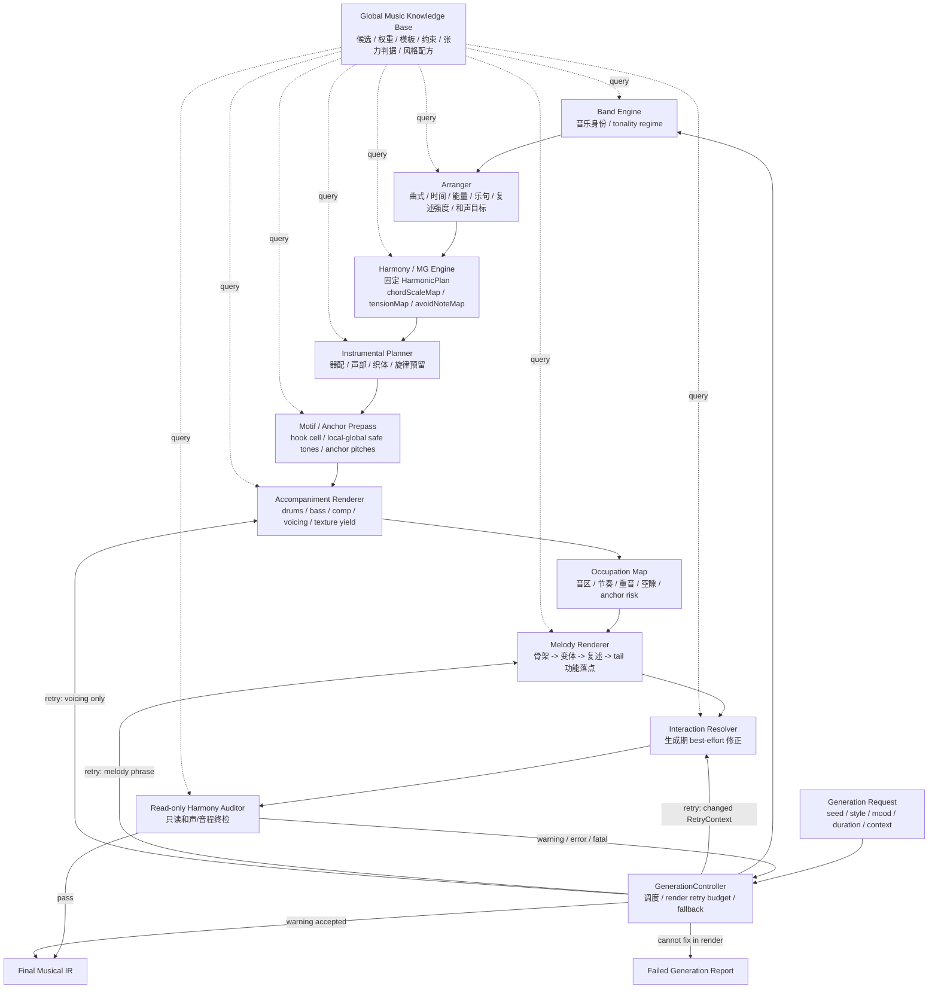

# 音乐生成引擎架构

日期: 2026-06-03

---

## 1. 架构总览

这套引擎由三条轴组成:

```text
音乐生成轴:
  Band Engine
    -> Arranger
    -> Harmony / MG Engine
    -> Instrumental Planner
    -> Render Layer
    -> Read-only Harmony Auditor

控制轴:
  GenerationController
    -> 调度生成
    -> 读取 AuditReport
    -> 控制 render 层 retry budget
    -> 决定 warning / fail

横向知识库:
  Global Music Knowledge Base
    -> 被每一层查询
    -> 提供候选、权重、模板、约束、张力判据和风格配方
```

主链路:

```text
Generation Request
  -> GenerationController
  -> Band Engine
  -> Arranger
  -> Harmony / MG Engine
  -> Instrumental Planner
  -> RenderCoordinator
       -> Motif / Anchor Prepass
       -> Accompaniment Renderer
       -> Occupation Map
       -> Melody Renderer
       -> Interaction Resolver
  -> Read-only Harmony Auditor
  -> Final Musical IR
```

审计回路:

```text
AuditReport(error / fatal)
  -> GenerationController
  -> RetryContext changed
  -> suggested render return point
       resolver local retry
       melody phrase retry
       accompaniment voicing retry
       render fallback
  -> re-audit
```

权威边界:

```text
Arranger 决定调式/调性 regime、结构、能量、密度、乐句功能和和声目标。
Harmony / MG 根据 Arranger 目标生成 HarmonicPlan。
HarmonicPlan 进入 Render 后不可变。
Render / Retry / Hook 只能在 HarmonicPlan 框内适应,不能反向改和声。
```

---

## 2. 总流程图



---

## 3. Global Music Knowledge Base

音乐知识库是查询型策略库。它不直接生成最终音符,而是给各层提供材料、权重、模板和判据。

```text
MusicKnowledgeBase
  |
  +-- PitchSystem
  |     pitch class / MIDI / octave / enharmonic
  |
  +-- DurationSystem
  |     whole / half / quarter / triplet / swing grid / slot
  |
  +-- TimeFeelLibrary
  |     style -> tempo range / meter / feel / phrase breathing
  |
  +-- ScaleLibrary
  |     major / minor / dorian / mixolydian / altered / diminished
  |
  +-- ChordLibrary
  |     chord tones / color tones / function / chord quality
  |
  +-- ProgressionLibrary
  |     ii-V-I / 1-6-4-5 / modal vamp / rhythm changes
  |
  +-- StyleDictionary
  |     jazz / lofi / pop / funk / modal / cinematic
  |
  +-- GrooveLibrary
  |     drum groove / bass pattern / comping rhythm
  |
  +-- TextureLibrary
  |     active comp / arpeggio / ostinato / pad / sustained block / walking bass
  |
  +-- VoicingLibrary
  |     close / open / drop2 / rootless / quartal / omit rules / slimming rules
  |
  +-- GrammarLibrary
  |     motif cell / transform / divide / variation / development
  |
  +-- GuideTonePolicyLibrary
  |     3rd / 7th targets / direction / contour / resolution
  |
  +-- ClimaxCalmRecipeLibrary
  |     calm / build / peak / release recipes
  |
  +-- ConstraintLibrary
        tension model / avoid notes / forbidden intervals / collision rules
```

### 3.1 张力模型

`ConstraintLibrary.tensionModel` 区分三类音:

```text
stable chord tone:
  root / 3rd / 5th / 7th 等当前和弦稳定音

acceptable tension:
  9 / #9 / 11 / #11 / 13 等按和弦品质和风格允许的张力

avoid note:
  当前和弦、风格、声部、时值条件下不应作为骨干或长时值暴露的音
```

同一张张力表供三处共用:

```text
选音阶段:
  Motif / Anchor Prepass 与 MelodyRenderer 查询 commonSafeToneSet。

生成期修正:
  InteractionResolver 用它做 best-effort 局部修正。

审计阶段:
  Read-only Harmony Auditor 用它判断 chord fit / avoid exposure。
```

### 3.2 数据和算法的比例

```text
KB 提供:
  候选集合
  权重
  模板
  约束
  风格配方
  张力判据

Engine 决定:
  当前曲子选哪一个候选
  如何按 seed / energy / section role 组合候选
  如何把抽象模板绑定成具体时间、音高、声部和音符
```

例子:

```text
request:
  style = lofi
  targetDuration = 100s
  mood = calm-build

KB returns:
  tempo candidates = 72..86 bpm, weighted around 78
  feel candidates = straight / light swing
  progression candidates = I-vi-IV-V, ii-V-I, modal vamp
  groove templates = laid-back kick/snare, sparse hats
  climax recipe = chorus density + harmonic rhythm + upper texture

Engine binds:
  Arranger picks 78 bpm, 4/4, light swing, verse/chorus form
  Harmony picks per-section progression and chord durations
  Instrumental picks drum/bass/keys activity and voicing range
  Render writes concrete notes and timings
```

---

## 4. Band Engine

Band Engine 定义音乐身份。

输入:

```text
GenerationRequest:
  seed
  styleHint
  mood
  targetDuration
  gameContext
  userConstraints
```

输出:

```text
BandSpec:
  style
  styleProfile
  tonalityKind        # tonal | modal
  key
  mode
  primaryScalePolicy
  borrowedScalePolicy
  instrumentPool
  roleMap
```

调式/调性 regime:

```text
tonal:
  和声严格、优先。
  melody / hook 必须适应 chordScaleMap / tensionMap。
  强排比撞和声时,先 voicing 支撑,再降锁深度,必要时接受 warning 或 fail。

modal:
  和声更宽松,常见静态 modal vamp 或低变化 harmonic field。
  primaryScale 可作为全局主约束。
  旋律跑 scale 构成色彩,对逐和弦贴合的约束更松。

tonal jazz:
  primaryScale 只作为身份提示。
  实际可用音以 per-chord chordScaleMap / tensionMap 为准。
```

---

## 5. Arranger

Arranger 定义全曲结构、时间、能量、乐句功能、复述强度和和声目标。

内部模块:

```text
Arranger
  |
  +-- FormPlanner
  |     sections / repeats / hook placement
  |
  +-- TimePlanner
  |     tempo / meter / feel / phrase breathing
  |
  +-- DynamicsPlanner
  |     energy / density / climax / harmonic rhythm target
  |
  +-- PhrasePlanner
        phrase role / cadence target / repeatGroup / restatementStrength
```

输出:

```text
ArrangementPlan:
  sections:
    id
    role              # intro | verse | chorus | bridge | outro
    bars
    repeatGroup
    hookPolicy        # none | light | main | call-response

  phrases:
    id
    sectionId
    bars
    phraseSlot
    role              # antecedent | consequent | climax | cadence | link | fill
    cadenceTarget
    repeatGroup
    localRepeatGroup?
    skeletonRole      # hook | connector | cadence | fill
    restatementStrength # 0.0..1.0, controls lock depth

  tempo:
    bpm
    tempoCurve?

  meter:
    numerator
    denominator

  feel:
    straight | swing | shuffle | half-time | double-time
    swingRatio

  phraseBreathing:
    phraseBars
    breathSlots
    cadenceBreathPolicy

  energyCurve
  densityCurve
  climaxMap
  harmonicRhythmTarget
  melodySpaceTarget
```

和声节奏归属:

```text
Arranger gives target:
  section energy
  harmonic rhythm density
  climax role

Harmony / MG realizes once:
  roman progression
  chord count
  chord duration
```

复述强度归属:

```text
Arranger:
  为每个 repeatGroup / phraseSlot 给 restatementStrength。

Render:
  把 restatementStrength 翻译成 motif 锁定深度。
```

---

## 6. Harmony / MG Engine

Harmony / MG Engine 负责生成固定和声计划。

输入:

```text
BandSpec
ArrangementPlan
MusicKnowledgeBase.progression/style/climax recipes
```

输出:

```text
HarmonicPlan:
  romanProgression
  chordTimeline
  chordFunctionTimeline
  chordScaleMap
  tensionMap
  stableToneMap
  colorToneMap
  avoidNoteMap
  borrowedChordMap
  modulationMap
  immutableAfterRenderStart = true
```

职责:

```text
按段落选择级数进行。
根据 key/mode/style 渲染真实和弦。
根据 Arranger 的高潮目标调整和声强度。
落实 harmonicRhythmTarget 为 chord count / chord duration。
为旋律、伴奏、Resolver、Auditor 提供 chordScaleMap / tensionMap / avoidNoteMap。
```

不可变边界:

```text
HarmonicPlan 一旦交给 Instrumental / Render,下游只读。
GenerationController 不重跑 Harmony。
AccompanimentRenderer 可以改变 voicing 怎么弹,但不能改变 HarmonicPlan 是什么和弦。
```

### 6.1 commonSafeToneSet 查询

```text
commonSafeToneSet(scope, motifId?, chordSpan):
  scope = local | global
```

`local span`:

```text
用途:
  句内模进、非复现句、连接句。

算法:
  对当前 chordSpan 内每个和弦查询 chordScaleMap / tensionMap / avoidNoteMap。
  取 chord tones + acceptable tensions 的交集。
  用于当前局部 phrase 的 head / 重音 / 骨干音。
```

`global span`:

```text
用途:
  复现 hook 的 head。

算法:
  找到同一 motifId 的所有出现位置。
  收集这些出现位置覆盖的和弦集合。
  对所有和弦的 chord tones + acceptable tensions 求交集。
  一次定死 head anchor,保证每次出现一致。
```

空交集处理:

```text
global span 为空:
  该 hook 自动降为弱排比。
  锁 rhythmCell + head contour,不锁 literal pitch。
  不报错,不重跑和声。

local span 为空:
  取次优候选或改用 GuideTone tail。
  仍不改 HarmonicPlan。
```

---

## 7. Instrumental Planner

Instrumental Planner 定义乐器如何参与演奏,以及伴奏需要为旋律预留什么。

输出:

```text
InstrumentationPlan:
  activityMap
  registerPlan
  texturePlan
  textureYieldPolicy
  voicingPlan
  articulationPlan
  silencePlan
  melodyReservationPlan
```

`textureYieldPolicy`:

```text
active comp / riff / arpeggio:
  需要为 hook 让位。
  让位方式包括减少 hit、避开锚点、调整 register、瘦身 voicing。

pad / sustained block / long tone texture:
  不需要专门让位。
  旋律可以自由浮在长音织体之上。
```

`melodyReservationPlan`:

```text
reservedRegister
rhythmicGaps
accentVacancies
densityCeiling
callResponseSlots
hookAnchorSlots:
  phraseId
  beatSlot
  preferredRegister
  anchorRequired
  segment           # head | tail | full-motif
  maxAccompanimentDensity
```

用途:

```text
伴奏正式先生成。
伴奏生成前先知道 hook 可能出现的节奏位置、音区和重音锚点。
active comp 按 reservation 避让,不要把 hook 的核心空间占满。
pad / sustained block 不按 hook 锚点做强制让位。
```

---

## 8. Render Layer

正式渲染由 `RenderCoordinator` 调度。

```text
RenderCoordinator
  |
  +-- Motif / Anchor Prepass
  |
  +-- Accompaniment Renderer
  |
  +-- Occupation Map
  |
  +-- Melody Renderer
  |
  +-- Interaction Resolver
```

### 8.1 Motif / Anchor Prepass

这个 prepass 只决定 hook 身份和锚点,不渲染完整旋律。

输入:

```text
ArrangementPlan.phrases
HarmonicPlan
InstrumentationPlan.melodyReservationPlan
MotifStore
MusicKnowledgeBase.grammar / guideTone / constraints
```

输出:

```text
MelodyAnchorPlan:
  phraseId
  motifId?
  skeletonSource
  rhythmCell?
  commonSafeToneScope   # local | global
  commonSafeToneSet
  selectedAnchorPitches:
    pitch
    beatSlot
    segment             # head | tail
    lockWeight
  restatementStrength
```

source 选择规则:

```text
hook / recurring phrase:
  Grammar motif cell 作为 skeleton source。
  目标是可记忆、可复述、可变体。
  复现 hook 的 head 用 global commonSafeToneSet。

connector / approach / cadence phrase:
  GuideTone skeleton 作为 source。
  目标是贴和弦、解决张力、连接段落。
  默认用 local commonSafeToneSet。

hybrid:
  Grammar 提供 rhythmCell。
  GuideTone 提供 tail 的 harmonic target。
```

强排比锚点:

```text
restatementStrength 高:
  Prepass 不只预定 head anchor。
  selectedAnchorPitches 扩展到被锁定的 tail。
  active comp 对整条锁死动机让位。
```

### 8.2 Accompaniment Renderer

输入:

```text
HarmonicPlan
InstrumentationPlan
MelodyAnchorPlan
```

输出:

```text
accompanimentTracks
occupationMap
```

包含:

```text
DrumRenderer
BassRenderer
CompingRenderer
VoicingRenderer
ArpeggioRenderer
PadRenderer
```

约束:

```text
遵守 density target。
遵守 register plan。
遵守 melody reservation。
遵守 textureYieldPolicy。
遵守 chordScaleMap / tensionMap / avoidNoteMap。
对 hook anchor 使用 voicing 支撑。
```

让位按织体分流:

```text
active comp / riff / arpeggio:
  需要看 selectedAnchorPitches。
  需要执行 voicing support / density reduction / register separation。

pad / sustained block / long tone:
  不因 hook anchor 强制让位。
  只遵守整体 register / density / chord policy。
```

voicing 支撑阶梯:

```text
1. 宽阔排列:
   把 2 度冲突拉成 9 度关系。

2. 音区让位:
   active comp / upper extension 避开 selectedAnchorPitches。

3. 降低伴奏密度:
   在 hook head / tail 锚点附近减少 comp hit。

4. 和声瘦身:
   改的是 voicing,不是 HarmonicPlan。
   按可丢弃度从高到低丢音:
     5 音  -> 最先丢
     根音  -> bass 覆盖时可丢
     7 音  -> 再丢,7 和弦可临时弹成三和弦色彩
     3 音  -> 永不丢,它定义大小调身份

   保底:
     3 + 7 guide-tone shell
     或 root + 3
```

### 8.3 Occupation Map

```text
OccupationMap:
  occupiedRegisters
  rhythmicDensityByBeat
  accentMap
  chordHitMap
  freeWindows
  reservedMelodyWindows
  anchorConflictRisk
  collisionRisk
```

### 8.4 Melody Renderer

旋律管线:

```text
Skeleton Source
  -> Motif Recall / Create
  -> Grammar Variation / Development
  -> Tail by Phrase Function
  -> Fit Occupation Map
  -> Melody Notes
```

Motif 模型:

```text
Motif:
  id
  source              # grammar | guidetone | hybrid
  rhythmCell          # 最硬身份
  contourGesture      # 中等身份
  noteSlots:
    slotId
    timeOffset
    duration
    scaleDegree?
    pitch?
    lockWeight
    segment           # head | tail
    functionalTarget?
```

Motif 绑定:

```text
MotifBinding:
  motifId
  repeatGroup
  localRepeatGroup?
  phraseSlot
  phraseId
  role
```

`motifId` 是主键。`repeatGroup / phraseSlot / phraseId` 只表达这个动机在哪里被使用。

restatementStrength 翻译成锁深度:

```text
weak:
  lock rhythmCell + head contour。
  tail 按 phrase role / cadenceTarget 重新生成。

medium:
  lock rhythmCell + contourGesture。
  pitch 可变,确保贴合当前 chordScaleMap。

strong:
  lock head anchor pitches,必要时锁 tail anchor。
  进入 voicing 支撑和伴奏让位。
```

tail 生成:

```text
antecedent:
  tail 倾向开放,保留继续感。

consequent:
  tail 倾向半收或回应。

climax:
  tail 承担高点、张力或音区峰值。

cadence:
  tail 落到明确终止目标。

link / fill:
  tail 优先使用 GuideTone 贴和弦连接。
```

句内模进:

```text
PhrasePlanner 给 phraseSlot / localRepeatGroup。
MelodyRenderer 在同一句内复用 motifId。
每次模进默认按 local chord span 重新查 commonSafeToneSet。
```

### 8.5 Melody Hook 防撞策略

预防:

```text
复现 hook 的 head:
  使用 global commonSafeToneSet。
  骨干音 / 重音 / head 必须来自所有出现位置共同安全的音集。

非复现句 / 句内模进:
  使用 local commonSafeToneSet。
  只对当前 chord span 取安全音交集。

avoid note:
  不得作为 hook 骨干或长时值重音。
```

复现 hook 消解阶梯:

```text
1. voicing 支撑:
   open voicing / omit rule / harmonic slimming / register separation / density reduction。

2. 降锁深度:
   restatementStrength strong -> medium -> weak。
   保留 rhythmCell 和 contour,释放 pitch 或 tail。

3. 换 hook:
   作为最后手段。
   因为换 hook 会破坏跨段身份。

4. 交给 GenerationController:
   使用 retry budget 和 changed RetryContext 进入 render 层重试。
```

非复现句消解阶梯:

```text
1. voicing 支撑。
2. 换局部候选。
3. 降锁深度或改用 GuideTone tail。
4. 交给 GenerationController。
```

Auditor 不提供人为意图豁免。合法性来自选音、voicing、织体分流和锁深度阶梯。

---

## 9. Interaction Resolver

Interaction Resolver 是生成期 best-effort 修正器,可以修改局部音符和局部 voicing。

处理:

```text
melody vs comp register collision
bass vs left-hand collision
accent clash
rhythm overcrowding
forbidden interval exposure
melody/accompaniment yielding
local voicing adjustment
```

工作方式:

```text
读取 ConstraintLibrary.tensionModel。
尽力做局部修正。
改得动就输出 resolved MusicalIR draft。
改不动也放过,交给 Auditor 只读报告。
真过不了再由 GenerationController 升级处理。
```

边界:

```text
Resolver 可以改音符和局部 voicing。
Resolver 不改全曲曲式、段落目标、风格身份和 HarmonicPlan。
```

---

## 10. Read-only Harmony Auditor

Auditor 是末端只读终检。

检查:

```text
chord fit
avoid note long exposure
acceptable tension classification
forbidden melodic interval
forbidden harmonic interval
tendency-tone resolution
illegal pitch relation under current chord policy
```

不处理:

```text
density
form
style curve
arrangement decision
mutation
人为意图豁免
HarmonicPlan rewrite
```

违规输出:

```text
AuditReport:
  severity       # warning | error | fatal
  location
  ruleId
  reason
  suggestedReturnPoint
  retryHint
```

硬边界:

```text
Auditor 只读。
Auditor 只报告。
Auditor 使用 ConstraintLibrary.tensionModel。
Auditor 不自己修音。
Auditor 不允许和声豁免口。
```

---

## 11. GenerationController

GenerationController 是控制回路 owner。

职责:

```text
run pipeline
read AuditReport
choose render return point
create changed RetryContext
enforce retry budget
call render fallback when budget exhausted
decide pass / warning / fail
```

可重试范围:

```text
resolver local retry
melody phrase retry
accompaniment voicing retry
render-level fallback
```

不可重试范围:

```text
Harmony / MG section retry
HarmonicPlan rewrite
Arranger rewrite
BandSpec regime rewrite
```

RetryContext 每次必须发生变化:

```text
advance RNG substream
choose next local candidate
lower restatementStrength
switch hook candidate inside existing anchor plan
regenerate tail with guide tones
choose safer voicing
apply harmonic slimming to voicing
reduce local accompaniment density
```

预算:

```text
per phrase retry <= N
per section retry <= M
whole song retry <= K
```

fallback:

```text
warning:
  可带 warning 通过。

error:
  回到 guaranteed-safe melody/voicing recipe 后再次审计。

fatal:
  render 层兜不住时,只能按产品策略降级为 warning 接受,或返回 failed generation report。
  不静默改写 HarmonicPlan。

fallback still fails:
  返回 failed generation report,不静默输出非法结果。
```

---

## 12. 数据流

```text
GenerationRequest
  |
  v
GenerationController
  |
  v
BandSpec
  | includes tonalityKind / regime
  v
ArrangementPlan
  | includes PhrasePlan / restatementStrength / harmonicRhythmTarget
  v
HarmonicPlan
  | immutable after render start
  | includes chordScaleMap / tensionMap / avoidNoteMap
  v
InstrumentationPlan
  | includes textureYieldPolicy / melodyReservationPlan / hookAnchorSlots
  v
MelodyAnchorPlan
  | includes motifId / commonSafeToneScope / commonSafeToneSet / selectedAnchorPitches
  v
AccompanimentTracks + OccupationMap
  |
  v
MelodyTracks
  |
  v
ResolvedMusicalIR
  |
  v
AuditReport
  |
  +-- pass --> FinalMusicalIR
  |
  +-- warning/error/fatal --> GenerationController
                               |
                               v
                            RetryContext changed
                               |
                               v
                            render return point only
```

---

## 13. 推荐模块结构

```text
src/core/generation/newEngine/
  generation/
    GenerationController.ts
    RetryPolicy.ts
    RetryContext.ts

  knowledge/
    MusicKnowledgeBase.ts
    pitchSystem.ts
    durationSystem.ts
    timeFeelLibrary.ts
    scales.ts
    chords.ts
    progressions.ts
    styleDictionary.ts
    grooves.ts
    textures.ts
    voicings.ts
    voicingSlimmingRules.ts
    grammarLibrary.ts
    guideTonePolicies.ts
    climaxCalmRecipes.ts
    constraints.ts
    tensionModel.ts

  band/
    BandEngine.ts
    BandSpec.ts
    TonalityRegime.ts

  arranger/
    Arranger.ts
    FormPlanner.ts
    TimePlanner.ts
    DynamicsPlanner.ts
    PhrasePlanner.ts
    ArrangementPlan.ts
    PhrasePlan.ts

  harmony/
    HarmonyEngine.ts
    MgHarmonyAdapter.ts
    HarmonicPlan.ts
    CommonSafeToneQuery.ts

  instrumental/
    InstrumentalPlanner.ts
    MelodyReservationPlanner.ts
    TextureYieldPolicy.ts
    InstrumentationPlan.ts
    MelodyReservationPlan.ts

  render/
    RenderCoordinator.ts
    MotifAnchorPrepass.ts
    MelodyAnchorPlan.ts
    AccompanimentRenderer.ts
    OccupationMap.ts
    MelodyRenderer.ts
    SkeletonGenerator.ts
    GrammarVariationEngine.ts
    Motif.ts
    MotifStore.ts
    InteractionResolver.ts
    ReadOnlyHarmonyAuditor.ts

  ir/
    MusicalIR.ts
    TrackIR.ts
    NoteIR.ts
    AuditReport.ts
```

---

## 14. 架构原则

```text
1. 正式生成顺序是 accompaniment-first。
2. accompaniment-first 需要 Motif / Anchor Prepass,让伴奏知道 hook 锚点。
3. Arranger 是最高权威,决定 regime、结构、时间、能量、乐句功能和和声目标。
4. Harmony / MG 根据 Arranger 目标生成固定 HarmonicPlan。
5. HarmonicPlan 进入 Render 后不可变;render / retry / hook 不能改和声。
6. tonal regime = 和声严格、旋律适应和声。
7. modal regime = 和声宽松、旋律可跑 primary scale 构成色彩。
8. Instrumental 管器配、声部、织体、voicing 策略和旋律预留。
9. 让位按织体分流:active comp 让位;pad / sustained block 不强制让位。
10. Grammar 是 motif / variation / development 工具。
11. GuideTone 主要服务连接句、终止句和 harmonic tail。
12. Motif 身份分层:rhythmCell > contourGesture > pitch。
13. restatementStrength 是锁深度滑块,不是段落类型硬编码。
14. 复现 hook 的 head 用 global commonSafeToneSet;局部句子用 local commonSafeToneSet。
15. global commonSafeToneSet 为空时,hook 自动降为弱排比,不重跑和声。
16. 复现 hook 防撞顺序:voicing 支撑 -> 降锁深度 -> 换 hook。
17. 非复现句防撞顺序:voicing 支撑 -> 换局部候选 -> 降锁深度或 GuideTone tail。
18. voicing 可瘦身,但这是弹法变化,不是 HarmonicPlan 改写。
19. Resolver 使用 tensionModel 做 best-effort 局部修正。
20. Auditor 只读、严格、只报告,不提供豁免。
21. GenerationController 只拥有 render 层 retry budget 和 fallback。
22. KB 提供候选、权重、模板、约束和张力判据。
23. Engine 把 KB 策略绑定到当前 song context。
```
