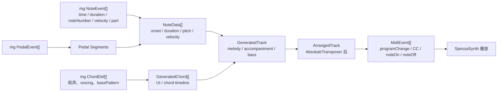

# 音乐生成逻辑链路流程图

本文把当前音乐生成主链路整理成流程图。代码入口以 `runPipeline` 为准，实际生成核心已经切到 `mgEngine`，之后经项目 IR、MIDI 渲染、调度器和 SpessaSynth 播放。

## 总览

```mermaid
flowchart TD
    A["App / AuraJam / AuraBar<br/>用户触发播放或生成"] --> B["runPipeline(options)<br/>src/core/generation/pipeline/index.ts"]

    B --> C["读取全局输入<br/>MgSeedStore / MgStyleStore / MgKeyStore"]
    C --> D["deriveMgSeed<br/>suffix + style prefix"]
    D --> E["runMgEngine({ seed, style, key })<br/>mgEngine/adapter.ts"]

    E --> F["new Engine(new Random(seed))<br/>确定性随机流"]
    F --> G["Engine.generateProgressions(config)<br/>生成和声骨架"]
    G --> H["Tonicization Planner<br/>先声明局部调性意图"]
    H --> I["Borrowed Chord Planner<br/>非局部区域做 modal interchange"]
    I --> J["Local Tonicization Color Planner<br/>局部调性区域内加颜色"]
    J --> K["realizeProgression<br/>罗马数字 / chord type → ChordDef"]
    K --> L["attachWidePianoVoicings<br/>附加钢琴宽排列"]

    L --> M["Engine.generateArrangement(chords, config)<br/>生成时间线"]
    M --> N["parseRoadMap + HarmonicSlots<br/>识别和声块 / 合约事实源"]
    N --> O["预规划 apex / meter / tension tracker / phrase plan"]
    O --> P["逐 bar generateBarPattern"]

    P --> Q["选择 / 变形 motif 或 lick"]
    Q --> R["buildMelodyPreview<br/>先投影旋律，供伴奏避让"]
    R --> S["CompingMode + TensionOwnership<br/>决定伴奏稠密度和省略"]
    S --> T["applyTexture<br/>渲染 chord / bass 织体"]
    T --> U["ArrangementContract 过滤<br/>避免 m2 冲突、保留 guide tones"]
    U --> V["输出 MusicTimeline<br/>events: melody / chord / bass<br/>pedalEvents"]

    V --> W["adapter 转项目 IR"]
    W --> X["eventsToNoteData<br/>melody / accompaniment / bass"]
    W --> Y["chordsToGeneratedChords<br/>供 UI / 审计显示"]
    X --> Z["GeneratedTrack + MusicContext<br/>keyOffset=0, bpm, tonality, timeSignature"]
    Y --> Z

    Z --> AA["runPipeline 路由 BandRole"]
    AA --> AB["MainInst 保留 melody<br/>Accomp 合并 chord + bass<br/>空槽剪枝"]
    AB --> AC["AudioEngine.playSong(track, styleId, context)"]

    AC --> AD["startAudioContext<br/>确保 SF2 合成器就绪"]
    AD --> AE["AbsoluteTransposer.arrange<br/>RELATIVE → ABSOLUTE"]
    AE --> AF["PlaybackEngine.loadSong"]
    AF --> AG["MidiConverter.convert<br/>NoteData → MidiEvent"]
    AG --> AH["globalMidiScheduler.loadTrack(events, bpm)"]
    AH --> AI["MidiScheduler 5ms tick loop"]
    AI --> AJ["SpessaSynth / GM SoundFont<br/>noteOn / noteOff / CC / programChange"]
```

## 生成核心细节

```mermaid
flowchart TD
    A["GenerationConfig<br/>seed / style / key / emotion"] --> B["resolveGeneration<br/>mode / meter / sectionFunction / motifInterval"]
    B --> C["pickProgression<br/>按风格选 progression skeleton"]
    C --> D["Planner 顺序固定"]
    D --> D1["1. Tonicization<br/>V/X、ii/X、目标 chord 先锁位"]
    D1 --> D2["2. Borrowed Chords<br/>只处理未锁定区域"]
    D2 --> D3["3. Local Color<br/>只处理 tonicized region"]
    D3 --> E["realizeProgression<br/>填 rootMidi / bassMidi / notesMidi / scale override"]
    E --> F["Wide Piano Voicing<br/>为 chord 附加更自然的钢琴排列"]

    F --> G["generateArrangement"]
    G --> H["RoadMap / Block 解析<br/>决定 lick brick 倾向"]
    H --> I["Song-level 规划<br/>apex、meter、texture、motif A/B/C、phrase role"]
    I --> J["逐 bar 生成"]

    J --> K["motif conflict 检查<br/>冲突高则转 develop"]
    K --> L["motifMutator<br/>密度、复杂度、swing、meter 缩放"]
    L --> M["buildMelodyPreview<br/>旋律真实 MIDI 预览"]
    M --> N["decideCompingModeForLick<br/>忙旋律 → 伴奏变薄"]
    N --> O["decideTensionOwnership<br/>旋律拥有 color 时伴奏让位"]
    O --> P["applyTexture<br/>按 textureCase 渲染 chord / bass"]
    P --> Q["ArrangementContract<br/>过滤重叠、近距离冲突、错误密集度"]
    Q --> R["Run / Passing / Cadence / Resolution 等旋律规则"]
    R --> S["NoteEvent[]<br/>part = melody / chord / bass"]
```

## 数据形态转换

## 关键约定

- `runPipeline` 是生成入口；当前唯一生成核心是 `mgEngine`。
- `mgEngine` 内部以 string seed 驱动 `Random`，并用派生 seed 隔离 planner / apex 等随机流，保证确定性。
- adapter 里 `keyOffset = 0`，mg 输出的 MIDI 音高按 absolute MIDI 透传；`AbsoluteTransposer` 仍是全管线唯一的 RELATIVE → ABSOLUTE 转换点。
- 当前路由是两层钢琴：`melody` 走 MainInst，`chord + bass` 合并进 Accomp；Bass / Drums / Atmosphere 槽在 mg 钢琴独奏模式下被清空。
- `MidiConverter` 不消耗 PRNG，只做确定性渲染：setup CC / programChange，加 noteOn / noteOff，并按 tick 和事件优先级排序。
