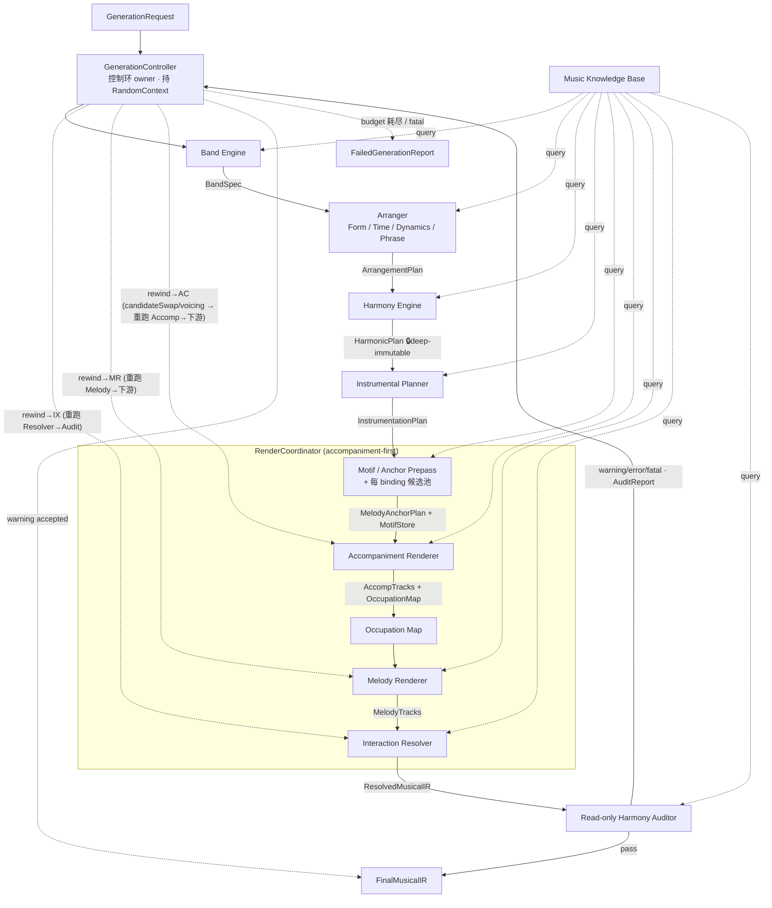

# newEngine 音乐生成引擎 — 架构定稿

日期: 2026-06-03
状态: **最终审计稿(设计锁定)** — 经 3 轮 Claude(执行端审计)↔ CODEX(架构端)对审,全部反馈已 fold,无开放待拍。
取代: `music_generation_engine_architecture.md`(CODEX 初稿)+ `..._audit.md` / `..._round2.md` / `..._round3.md`(三轮执行端 audit)。本文是实现的唯一真理源。
读法:**契约在前**。Part 2 是架构主体(层间的缝 = 冻结 interface);Part 3 把模块退成"两契约之间的纯变换"。附录是全部锁定决策的归纳清单 = 实现/审计对照表。

---

## ⚠️ 现状对齐(2026-06-06,MG 旋律迁移后)

> 本文是 **2026-06-03 的架构原意**。之后的 **MG 旋律引擎迁移**(见 `docs/mg_melody_strict_newengine_migration_directive.md`,用户 decision C「全量接收 MG 旋律」)**有意替换了旋律子系统**,代码因此与本文偏离。下列偏离是**已知、有意**的,不是事故性腐烂。**承重不变量(权威链 / HarmonicPlan 深不可变 / accompaniment-first 单路径 / 确定性 / 只读 Auditor / render-only retry)全部仍 HOLD**;偏离集中在 **Motif/旋律这一个支柱**。再耦合或正式退役由 backlog 决断项(`docs/newEngine_backlog.md` 的「MG 旋律 ↔ Motif 子系统」)定夺。

```text
代码现状 ≠ 本文原意(逐条,详见 Part 1 / Part 5 / Part 7 内联 ⚠️):

D1  MelodyRenderer 被换:lead = MG 链(render/mgLeadRenderer.renderMgMelody,读 HarmonicPlan,
    不读 MotifStore)。凝聚力(记忆点/排比)改由 MG repeatGroup 机制,不走 Motif 复述(原 Part 2.7/附录 D)。
D2  Prepass 输出 dead:runPrepass 仍跑(保 rng 流确定性)+ MotifStore 仍喂 retry locator,
    但旋律不消费 anchorPlan/motifStore(renderCoordinator `void anchorPlan; void motifStore`)。
    comp 的 melody-aware 让位改从 instrumentation.melodyReservationPlan.hookAnchorSlots 取锚点。
D3  retry 旋律杠杆 dead:candidateSwap / restatementOverride 被 void;只有 voicingSafer(comp 瘦身)活。
    → Auditor 仍能「感知」旋律撞音,但 retry 在旋律侧「执行不了」(只能瘦 comp);
      安全性现押在 MG shapeMelodyHarmony 的上游预防(原 Part 5 rewind-melody / 附录 E4 melody 防撞阶梯退役)。
D4  lead 旁路全局后处理(Loop 9):lead 跳过 swing / 力度人性化 / 时序抖动 / resolver 八度上移
    (MG StyleRenderer 自带 feel,避免双 swing/双 accent)。本文原意是全轨统一后处理。
D5  次要:代码里 Instrumental 跑在 Harmony 之前(本文脊柱是 Harmony→Instrumental)。
    因 buildInstrumentationPlan 不读 harmonic → 无害,但偏离线性脊柱顺序。

新增(本文之后落地,不算偏离、属 render 层细化):
  · pad↔comp 分工(docs/pad_comp_interaction_directive.md):pad=sustain/air 辅助轨,
    7 mode 按 PadCompDecision 选;只动 pad 单轨 + comp 最轻避让,守正交音阶。不碰脊柱。
```

---

## Part 0 · 预期与原则

### 0.1 零历史债(本次重构的硬前提)

1. **独立分叉管线**。newEngine 是与 improCore / mgEngine 并存的**全新管线**,**不 import 它们任何东西**(连类型都不借)。两库继续活在自己的沙盒,互不干涉。
2. **不背旧契约**。没有 `ChordDef` / `NoteEvent` / `GenerationConfig` 等既有形状;newEngine 按本架构语义自定义全部 IR / Plan 契约(见 Part 2)。
3. **不背规则记忆**。"mgEngine 是真理源 / 别重复造 / forcedStyleId"等旧约束本次作废。
4. **旧代码仅作参考读物**。可翻阅旧实现学算法,但不得形成依赖。data-port 的资产(如 grammar)要写 schema adapter、标 provenance、不背旧运行时契约。

### 0.2 轻耦合重聚合(组织原则)

- **轻耦合** — 层与层只通过**冻结的数据契约**对话(Part 2),谁都不许伸手进邻层内部。每个 stage = `输入契约 → 输出契约`,可单独 stub / 替换 / 单测。**除 Controller 那条唯一重跑回边,系统无其它反向边;无隐藏可变状态(状态一律显式顺管线流,且是值对象快照、非服务单例)。**
- **重聚合** — 价值在编排缝上:`GenerationController` / `RenderCoordinator` 把一堆**单一职责、高内聚的小模块**组合成曲子。聚合只发生在 orchestrator,不发生在任何模块内部——没有哪个模块认识一大堆别的模块。

### 0.3 乐理资产策略 = B(纯乐理事实可 port)

- 架构 / 契约 / 编排全 **clean-room**。
- 但"C# 压 A7 拼成 #9""Dm7 的 avoid note 是哪个""drop2 怎么排"这类**纯乐理事实/数学**,允许从旧实现 **port 进 newEngine 的干净新文件**(新文件、0 import、不背旧结构),不重造乐理轮子。Part 4 逐项标 `B-port`(乐理事实)/ `data-port`(作者化数据资产)/ `new`(clean-room 新写)。

### 0.4 范围:tonal 先行

`tonalityKind` 是一等 regime 开关(`BandSpec.tonalityKind`)。**首版只跑 `tonal`**(audit 火力都在这条严格路径上);`modal` 作为第二 regime,脊柱稳后再挂。契约里两 regime 字段都留,逻辑先只实现 tonal 分支。

### 0.5 架构铁律(实现期不得违背)

```text
权威链
  1. Arranger 是最高权威:定死 调式/调性 regime、曲式、时间、能量、乐句功能、和声目标。
  2. Harmony 按 Arranger 目标生成 HarmonicPlan。
  3. HarmonicPlan 进入 Render 后【深】不可变(冻结容器 + 运行期 deepFreeze)。render / retry / hook
     一律只能在框内适应,永远不能反过来改和声;Render 静默降级也不得改 Arranger 的意图字段。

生成顺序与确定性
  4. 全曲单一路径 = accompaniment-first(先伴奏后旋律),无 melody-first 分支、无 renderOrderPolicy 开关。
  5. accompaniment-first 必须 melody-aware:伴奏生成前先经 Motif/Anchor Prepass 拿到 hook 锚点。
  6. 全管线确定性:同 seed + 同输入 → 同输出。一切随机走 RandomContext 命名子流;一切时间走 Timebase。

regime
  7. tonal = 和声严格、旋律适应和声(撞则降弱、接受)。
  8. modal = 和声宽松/静态(modal vamp)、旋律跑 primaryScale 构成色彩,逐和弦约束松。

凝聚力
  9. 记忆点 = 重复的选择(押韵),不是逐音复印:同动机跨和弦复现(模进)+ 同功能段落排比。
 10. 归家感 = Arranger 的 T-S-D 功能进行。
 11. 动机身份分层:rhythmCell > contourGesture > scaleDegree。Motif 纯抽象,绝不带具体 pitch/调/音区。
 12. restatementStrength 是连续标量(锁深度滑块),与段落类型解耦;松呼应↔强排比一首歌里共存。

源与变体
 13. Grammar = motif / variation / development 工具(只借变体,不调旧 faithful solo 顶管)。
 14. GuideTone 主要服务连接句、终止句和 harmonic tail。
 15. 源由角色驱动:hook 句 → grammar cell(可复述);连接句 → guidetone(贴和弦)。

让位与撞音
 16. 让位按织体分流:active comp 为 hook 让位;pad / 柱式长音织体不让位,旋律自由浮于其上。
 17. 撞音靠"选音 + voicing + 锁深度阶梯"在 renderer 内预消解。voicing 可瘦身,但这是弹法变化,
     不是 HarmonicPlan 改写。
 18. 复现 hook 防撞序:voicing 支撑 → 降锁深度 → 候选池换 hook(垫底,毁跨段身份)。
     非复现句防撞序:voicing 支撑 → 换局部候选 → 降锁深度 / GuideTone tail。

传感器与执行器
 19. Auditor = 传感器:只读、严格、只判和声/音程,不审密度、不开任何豁免口(无 intentional 豁免)。
 20. Resolver = 执行器:生成期 best-effort 局部读改,改不动放过,交 Auditor 只读报告。
 21. tensionModel 是判据,选音 / Resolver / Auditor 三处共用同一张表。
 22. GenerationController 只拥有 render 层 retry budget + fallback;碰不到 Arranger / Harmony / Band。
     任一 return point = 从该 stage 回卷重跑【整条下游后缀】,不做局部外科补丁。
     retry 只能在 Prepass 预备好的候选池内切,绝不新建 motif/realization、绝不重跑 Prepass。

KB
 23. KB 给候选 / 权重 / 模板 / 约束 / 张力判据 / 风格配方;Engine 把它绑定到当前 song context。
```

---

## Part 1 · 管线脊柱

> ⚠️ **现状(2026-06-06)**:脊柱形态仍成立,但 `MR`(Melody Renderer)节点实际是 **MG 链**(`renderMgMelody`,读 HarmonicPlan 不读 MotifStore);`MA`(Prepass)仍跑但输出对旋律 dead;控制环回边的旋律杠杆(candidateSwap)dead,只 voicingSafer 活。详见顶部「现状对齐」D1–D3。下文 mermaid/契约链是 **2026-06-03 原意**。

单链 + 唯一回边。每个箭头命名其契约(详见 Part 2)。



**唯一回边的硬边界:** Controller 的重跑只能落在 `IX` / `MR` / `AC` 三个 render 层返回点,语义是**回卷**——从该 stage 重跑整条下游后缀。**没有任何边指回 MG / AR / BE / Prepass**——和声、曲式、regime、动机候选池对 retry 不可变;retry 只在候选池内 overlay 切换。

契约链(线性主干):

```text
GenerationRequest
  → BandSpec              (Band Engine)
  → ArrangementPlan       (Arranger)
  → HarmonicPlan          (Harmony Engine)   🔒 此后 deep-immutable
  → InstrumentationPlan   (Instrumental Planner)
  → MelodyAnchorPlan + MotifStore  (Motif/Anchor Prepass)   ← 状态显式输出 + 候选池
  → AccompanimentTracks + OccupationMap  (Accompaniment Renderer)
  → MelodyTracks          (Melody Renderer,只读 MotifStore)
  → ResolvedMusicalIR     (Interaction Resolver)
  → AuditReport           (Auditor)
  → FinalMusicalIR  |  back-edge → GenerationController (render 层回卷 retry)
```

---

## Part 2 · 数据契约(架构主体)

> 这一节是 newEngine 的真正定义。每个缝 = 一个冻结 interface。每个契约下的 **▸** 是该处的关键设计决策。

### 2.0 基元类型、不可变容器与三底座

```ts
// —— 工具类型 ——
type Brand<T, B> = T & { readonly __brand: B };
type DeepReadonly<T> =
  T extends (infer U)[] ? ReadonlyArray<DeepReadonly<U>> :
  T extends object ? { readonly [K in keyof T]: DeepReadonly<T[K]> } :
  T;

// ★ 冻结契约【禁用裸 Map/Set】:Object.freeze(map) 挡不住 map.set()。
//   键都是 string ID → 一律用 Record<string,V>(deepFreeze 递归冻得住、O(1) 查);
//   set 用 Record<K,true>;若将来需富键用显式 FrozenMap 包装器,不用原生 Map。
// deepFreeze(obj):递归 Object.freeze 所有 plain object / array,运行期兜底。

// —— 基元(pitch + time 全 branded,挡 off-by-12 / octave / tick-beat 混用)——
type PitchClass = Brand<number, 'PitchClass'>;   // 0..11
type Midi = Brand<number, 'Midi'>;               // 0..127
type Beats = Brand<number, 'Beats'>;             // 以四分音符为 1.0
type Ticks = Brand<number, 'Ticks'>;             // PPQ 整数网格
type ScaleDegree = number;  // 1..7(相对当前调/和弦)
type SectionId = string;
type PhraseId = string;
type MotifId = string;
type MotifBindingId = string;        // ★ 稳定主键:retry override / realization / 候选池都按此粒度
type MotifCandidateId = string;      // ★ 候选池内候选键(retry candidateSwap 切换目标)
type RepeatGroupId = string;
type LocalRepeatGroupId = string;
type ChordSpanId = string;
type Scale = PitchClass[];
type HarmonicFunction = 'T' | 'S' | 'D';

// —— 集中构造器:唯一合法的 branded 创建入口,内部 validate;运算走 helper ——
//   pc(n) / midi(n) / beats(n) / ticks(n);时间换算只许走 Timebase,不许裸算 tick↔beat。

// —— 结构化 RomanChord(不裸 string,避免和声核心变解析泥潭)——
interface RomanChord {
  degree: 1 | 2 | 3 | 4 | 5 | 6 | 7;
  accidental: 'bb' | 'b' | 'natural' | '#' | 'x';
  quality: ChordQuality;               // 'maj7' | 'm7' | '7' | 'm7b5' | 'dim7' | ...
  secondaryTarget?: RomanChord;        // V7/V 的 "/V";递归表达二级属
  inversion?: 0 | 1 | 2 | 3;
}
```

**2.0.1 Timebase** — 全管线唯一时间换算底座(由 `ArrangementPlan.tempo/meter` 构造,Harmony 起共享)

```ts
interface Timebase {
  readonly ppq: number;                          // ticks per quarter
  readonly meter: Meter;
  readonly tempoMap: ReadonlyArray<TempoEvent>;  // 支持 tempoCurve
  beatToTick(beat: Beats): Ticks;                // ★ tick↔beat 换算的唯一合法入口
  tickToBeat(tick: Ticks): Beats;
  barToBeat(bar: number): Beats;
}
```

**2.0.2 RandomContext** — 确定性 RNG 底座(retry 收敛的前提,铁律6)

```ts
// 同 seed + 同输入 → 同输出。每个 stage 用【命名子流】(确定性派生自 seed+name)。
// retry 时只 advance【一个】子流,不扰动其它 stage 的产出。
interface RandomContext {
  readonly seed: number;
  substream(name: StageName): Rng;                    // 取某 stage 的确定性子流
  advance(name: StageName): RandomContext;            // 推进某子流 → 返回【新】context(不可变)
}
type StageName =
  | 'arranger' | 'harmony' | 'instrumental'
  | 'prepass' | 'accompaniment' | 'melody' | 'resolver';
interface Rng {
  next(): number;                                     // [0,1)
  int(maxExclusive: number): number;
  pick<T>(xs: readonly T[]): T;
}
```

> ▸ `RandomContext` 由 `GenerationRequest.seed` 构造,**GenerationController 持有**并按 stage 派子流;`Timebase` 在 Arranger 出 `ArrangementPlan` 后构造,Harmony 及之后所有层共享同一实例。

### 2.1 GenerationRequest

```ts
interface GenerationRequest {
  seed: number;                  // 确定性总种子 → 构造 RandomContext
  styleHint: string;             // StyleDictionary key, e.g. 'lofi' | 'jazz'
  mood: string;                  // e.g. 'calm-build'
  targetDuration: number;        // 秒
  gameContext?: GameContext;     // 来自游戏/模拟层(可空)
  userConstraints?: UserConstraints;
}
```

### 2.2 BandSpec — 音乐身份 + regime

```ts
type TonalityKind = 'tonal' | 'modal';     // ★ 一等 regime 开关

interface BandSpec {
  style: string;
  styleProfile: StyleProfile;
  tonalityKind: TonalityKind;
  key: PitchClass;
  mode: Mode;                        // 'major'|'minor'|'dorian'|'mixolydian'|...
  primaryScalePolicy: ScalePolicy;   // modal: 全局主约束;tonal jazz: 仅身份提示,实际看 chordScaleMap
  borrowedScalePolicy: ScalePolicy;
  instrumentPool: InstrumentRole[];
  roleMap: RoleMap;                  // 乐器 → 角色(bass/comp/pad/lead/drum...)
}

interface StyleProfile {
  accompDensity: number;   // 0..1
  padDensity: number;
  melodyFreedom: number;   // 旋律对逐和弦贴合的松紧
  tensionCarrier: 'melody' | 'voicing' | 'both';
  colorBudget: number;     // 色彩音预算
  beatStrictness: number;  // 节奏对齐严格度
}
```

### 2.3 ArrangementPlan — 全曲骨架(Arranger 输出,最高权威)

```ts
interface ArrangementPlan {
  sections: Section[];
  phrases: Phrase[];
  motifBindings: MotifBinding[];        // ★ 凝聚力引擎:slot → motifId + 排比关系
  tempo: Tempo;
  meter: Meter;
  feel: Feel;
  phraseBreathing: PhraseBreathing;
  energyCurve: Curve;
  densityCurve: Curve;                  // 宏观密度(下游生成期照做,Auditor 不审)
  climaxMap: ClimaxMap;                 // 高潮位置/强度(一般落 chorus)
  harmonicRhythmTarget: HarmonicRhythmTarget;   // 仅目标,Harmony 落实 chord count/duration
  melodySpaceTarget: MelodySpaceTarget;
}

interface Section {
  id: SectionId;
  role: 'intro' | 'verse' | 'chorus' | 'bridge' | 'outro';
  bars: number;
  repeatGroup?: RepeatGroupId;          // 同功能段落排比(verse1≈verse2)
  hookPolicy: 'none' | 'light' | 'main' | 'call-response';
}

interface Phrase {
  id: PhraseId;
  sectionId: SectionId;
  bars: number;
  phraseSlot: number;
  role: 'antecedent' | 'consequent' | 'climax' | 'cadence' | 'link' | 'fill';
  cadenceTarget: CadenceTarget;         // tail 落点功能(开放/半收/高潮/终止)
  repeatGroup?: RepeatGroupId;
  localRepeatGroup?: LocalRepeatGroupId; // 句内模进粒度
  skeletonRole: 'hook' | 'connector' | 'cadence' | 'fill';  // → 驱动源选择(铁律15)
}

interface MotifBinding {
  id: MotifBindingId;                    // ★ 稳定主键
  motifId: MotifId;                      // 该 binding 引用哪个动机
  phraseId: PhraseId;
  repeatGroup?: RepeatGroupId;           // 段间排比
  localRepeatGroup?: LocalRepeatGroupId; // 句内模进
  requestedRestatementStrength: number;  // 0..1 Arranger 戏剧意图,【不可变】
}

interface Feel {
  kind: 'straight' | 'swing' | 'shuffle' | 'half-time' | 'double-time';
  swingRatio: number;
}

interface PhraseBreathing {
  phraseBars: number;
  breathSlots: BeatSlot[];
  cadenceBreathPolicy: CadenceBreathPolicy;
}
```

> ▸ **restatementStrength 挂 MotifBinding**(一句可绑多动机,强度天然挂 motif↔slot 绑定),拆 `requested`(此处,不可变意图)/ `effective`(MelodyAnchorEntry,Render 实际锁档)。
> ▸ **锁档分界** `[0,.34) 弱 / [.34,.67) 中 / [.67,1] 强`(v1 默认),强档进 voicing 支撑阶梯。**不设第四档 literal 死锁**(强档已可由 anchor + voicing 支撑表达,第四档徒增 collision/retry 压力)。

### 2.4 HarmonicPlan — 固定和声计划(🔒 深不可变)

```ts
// 交付时对 HarmonicPlanData 递归 deepFreeze;类型层用 DeepReadonly 编译期挡写。双重不可变。
// ★ 所有 *Map 字段是 Record(plain object),【不是】原生 Map —— Object.freeze 才锁得住。
type HarmonicPlan = DeepReadonly<HarmonicPlanData>;

interface HarmonicPlanData {
  romanProgression: RomanChord[];
  chordTimeline: ChordSpan[];                          // 和弦 + 起点 + 时长
  chordFunctionTimeline: HarmonicFunction[];           // 每和弦 T|S|D
  chordScaleMap: Record<ChordSpanId, Scale>;           // B-port 乐理
  tensionMap: Record<ChordSpanId, TensionTable>;       // B-port 乐理
  stableToneMap: Record<ChordSpanId, PitchClass[]>;    // 和弦稳定音
  colorToneMap: Record<ChordSpanId, PitchClass[]>;     // 可接受张力音
  avoidNoteMap: Record<ChordSpanId, PitchClass[]>;     // avoid note
  borrowedChordMap?: Record<ChordSpanId, BorrowInfo>;
  modulationMap?: Record<SectionId, ModulationInfo>;
}

interface ChordSpan {
  id: ChordSpanId;
  roman: RomanChord;
  rootPc: PitchClass;
  quality: ChordQuality;
  startBeat: Beats;
  durationBeats: Beats;
  sectionId: SectionId;
}

interface TensionTable {
  stable: PitchClass[];      // root/3/5/7 等稳定音
  acceptable: PitchClass[];  // 9/#9/11/#11/13 等按品质+风格允许的张力
  avoid: PitchClass[];       // 当前和弦/风格/声部/时值下不应暴露的音
}
```

> ▸ **深不可变承重整条权威链**(铁律1/3):浅 `readonly` 锁不住数组、`Object.freeze` 锁不住 Map。故契约用 `Record` + `DeepReadonly`(编译期)+ `deepFreeze()`(运行期)双保险。

**commonSafeToneSet 查询**(挂 HarmonicPlan 的派生函数,**不是存储字段**):

```ts
type SafeToneScope = 'local' | 'global';

// ★ global 需要 motif 全部出现位置 → 由 Prepass 先解析,查询函数只吃【已解析的 span 列表】,
//   保持对 HarmonicPlan 纯、不碰 motif 概念。
//
// 解析(Prepass 职责,见 3.5):
//   resolveOccurrenceSpans(motifId, motifBindings, phrases, chordTimeline) → ChordSpanId[]
//     local : 当前 phrase 覆盖的 chord span
//     global: 该 motifId 所有 binding 出现位置覆盖的 chord span 【并集】
//
// 查询(纯函数):
function commonSafeToneSet(
  plan: HarmonicPlan,
  scope: SafeToneScope,
  spans: ChordSpanId[],
): PitchClass[];            // = ∩(各和弦 stable ∪ acceptable);真 avoid 永不入集
```

> ▸ **空交集策略**:
> - **global span 为空**(hook 跨太远和声)→ 该 hook **自动降弱排比**(锁 rhythmCell + head contour,不锁 literal pitch);写 `effectiveRestatementStrength` + `downgradeReason='empty-global-safe-tone'`;不报错、**不重跑和声**。
> - **local span 为空** → 取次优候选或 GuideTone tail;仍不改 HarmonicPlan。
> 降级在 Prepass 内做(3.5),不进 Controller 重跑环。

### 2.5 InstrumentationPlan — 器配 + 旋律预留

```ts
interface InstrumentationPlan {
  activityMap: ActivityMap;
  registerPlan: RegisterPlan;
  texturePlan: TexturePlan;
  textureYieldPolicy: TextureYieldPolicy;
  voicingPlan: VoicingPlan;
  articulationPlan: ArticulationPlan;
  silencePlan: SilencePlan;
  melodyReservationPlan: MelodyReservationPlan;
}

// 让位按织体分流(铁律16)
interface TextureYieldPolicy {
  // 'active'   = active comp / riff / arpeggio:要为 hook 让位
  // 'floating' = pad / sustained block / long tone:不让位,旋律自由浮于其上
  perTexture: Record<TextureKind, 'active' | 'floating'>;
}

interface MelodyReservationPlan {
  reservedRegister: RegisterRange;
  rhythmicGaps: Gap[];
  accentVacancies: BeatSlot[];
  densityCeiling: number;
  callResponseSlots: BeatSlot[];
  hookAnchorSlots: HookAnchorSlot[];    // ★ 伴奏生成前就知道 hook 可能落的【窗口+要求】
}

interface HookAnchorSlot {
  phraseId: PhraseId;
  beatSlot: BeatSlot;
  preferredRegister: RegisterRange;
  anchorRequired: boolean;
  segment: 'head' | 'tail' | 'full-motif';
  maxAccompanimentDensity: number;
}
```

> ▸ 这里给 hook 的【窗口和要求】;具体【锚点音高】由 Prepass 填进候选池(2.6/2.7),Accompaniment 经 `resolveEffectiveCandidate` 读。这样 accompaniment-first 才能迁就已知 hook。

### 2.6 MelodyAnchorPlan + MotifStore — Prepass 输出(状态显式 + 候选池)

Prepass 输出**两个并行契约**,由 RenderCoordinator 顺管线往下传:

```ts
interface PrepassOutput {
  anchorPlan: MelodyAnchorPlan;
  motifStore: MotifStore;        // ★ 值对象快照(非服务单例),含每 binding 候选池
}

interface MelodyAnchorPlan {
  entries: MelodyAnchorEntry[];
}

interface MelodyAnchorEntry {
  // ★ 只留【候选无关】的 binding 级字段(防 candidateSwap 后字段过期)。
  //   候选特定字段(motifId / skeletonSource / rhythmCell / anchorPitches)在 MotifCandidate,
  //   一律经 resolveEffectiveCandidate(...) 取,下游不得直读 entry 上的候选字段。
  phraseId: PhraseId;
  bindingId: MotifBindingId;              // ★ 指回 binding;候选/锚点经 resolveEffectiveCandidate 取
  commonSafeToneScope: SafeToneScope;     // 复现 hook head=global;其余=local(候选无关)
  commonSafeToneSet: PitchClass[];        // 由 binding 覆盖的和弦 span 决定(候选无关)
  requestedRestatementStrength: number;   // Arranger 意图,不可变
  effectiveRestatementStrength: number;   // Render 实际锁档(可能已被降级)
  downgradeReason?: 'empty-global-safe-tone' | 'collision-ladder' | 'retry-lowered';
}

// ★ 唯一有效候选入口:Accompaniment / Melody 只读它的结果,绝不直读 entry 上可能过期的候选字段。
//   有效候选 = retryContext?.candidateSwap[bindingId] ?? pool.selectedCandidateId
function resolveEffectiveCandidate(
  bindingId: MotifBindingId,
  motifStore: MotifStore,
  retryContext?: RetryContext,
): MotifCandidate;
```

> ▸ **requested / effective 拆分**:Arranger 戏剧意图永不被 Render 静默改;Render 只写 `effective` + `downgradeReason`,意图与实际之差可追溯。

### 2.7 Motif / MotifStore / 候选池 / MotifRealization

```ts
// ★ Motif = 纯抽象身份。【无 pitch / 无调 / 无音区】——具体音高一律进 MotifRealization / AnchorPitch
//   (冻 pitch 进 Motif 会污染抽象身份,移调/跨段复述变脏)。
interface Motif {
  id: MotifId;
  source: 'grammar' | 'guidetone' | 'hybrid';
  rhythmCell: RhythmCell;            // 身份最硬,几乎所有复述都锁
  contourGesture: ContourGesture;    // 中等身份
  noteSlots: NoteSlot[];
}

interface NoteSlot {
  slotId: number;
  timeOffset: Beats;
  duration: Beats;
  scaleDegree: ScaleDegree;          // 始终在 = 抽象身份恒在(无 pitch 字段)
  lockWeight: number;                // 默认从 segment + 节奏位派生,可显式覆盖
  segment: 'head' | 'tail';
  functionalTarget?: FunctionalTarget; // tail 用:落到开放/半收/高潮/终止目标
}

// ★ MotifStore = Prepass 的【显式不可变值对象快照】。MelodyRenderer / Accompaniment 只读。
type MotifStore = DeepReadonly<{
  motifs: Record<MotifId, Motif>;                                 // 抽象动机定义(共享)
  bindingCandidates: Record<MotifBindingId, BindingCandidatePool>; // 每 binding 的候选池
}>;

// ★ 候选池:retry/ladder 换 hook 只能在此池内切,不重跑 Prepass、不新建数据。
interface BindingCandidatePool {
  bindingId: MotifBindingId;
  selectedCandidateId: MotifCandidateId;                 // 默认主选
  candidates: Record<MotifCandidateId, MotifCandidate>;  // Record 查找(overlay 按 id 查)
  candidateOrder: MotifCandidateId[];                    // 稳定顺序(retry 取次优用)
  referenceBindingId?: MotifBindingId;                   // ★ 强复述拷贝源 binding(binding 级);
                                                         //   undefined = 该 repeatGroup 的参照本身
}

interface MotifCandidate {
  candidateId: MotifCandidateId;
  motifId: MotifId;                                    // 候选特定:指向 motifs 抽象动机
  skeletonSource: 'grammar' | 'guidetone' | 'hybrid';  // 候选特定
  rhythmCell: RhythmCell;                              // 候选特定
  anchorPitches: AnchorPitch[];                        // 该候选锚点(喂 Accompaniment 让位)
  realization: MotifRealization;                       // 该候选具体实化音高
}

// MotifRealization = 在某 binding 处把抽象 Motif 实化的具体音高。调/音区/八度都在这里,不污染 Motif。
interface MotifRealization {
  bindingId: MotifBindingId;
  motifId: MotifId;
  pitches: AnchorPitch[];                // 具体 Midi + beatSlot + segment
}

interface AnchorPitch {
  pitch: Midi;
  beatSlot: BeatSlot;
  segment: 'head' | 'tail';     // 强排比时 tail 也进锚点(铁律18 让位)
  lockWeight: number;
}
```

**锁深度 = f(effectiveRestatementStrength)**(铁律12):

```text
弱: 锁 rhythmCell + head contour      → tail 按 cadenceTarget 功能自由生成   ← 默认,天生干净
中: 锁 rhythmCell + contourGesture    → 放 pitch(每次按当前 chordScaleMap 重算 scaleDegree→pitch)
强: 锁到 head anchor pitch(必要时锁 tail anchor)
    → 拷贝源 = resolveEffectiveCandidate(pool.referenceBindingId).realization.pitches
      (拷参照 binding 的【有效候选】realization,非静态主选)→ 进 voicing 支撑阶梯 + 伴奏让位
```

> ▸ **Motif 纯抽象 / pitch 在 Realization / referenceBindingId 显式 / lockWeight 派生**:抽象动机永远干净、可跨段跨调复用;`lockWeight` 默认从 `segment + 节奏位` 派生,允许显式覆盖。

**复述机制(状态显式 + 候选池,无 hidden mutation):**

```text
Prepass(一次性,前置定死全部动机身份 + 候选池):
  逐 binding 选 source/grammar → 生成抽象 Motif(rhythmCell + contour + noteSlots[scaleDegree])
  → 每个 repeatGroup 指定【参照 binding】(首次出现),其 pool.referenceBindingId=undefined;
    同组后续 binding 的 pool.referenceBindingId 指向该参照(保证 reference graph 无环)
  → 为每个 binding 准备候选池(主选 + K 备选,各带 motif/source/rhythmCell/realization/anchorPitches),
    全部冻进 MotifStore

MelodyRenderer(只读 MotifStore + RetryContext overlay):
  有效候选 = resolveEffectiveCandidate(bindingId, motifStore, retryContext)   ← 唯一入口,不直读 entry
  按 effectiveRestatementStrength 锁档复述:
    强 → 拷贝 resolveEffectiveCandidate(pool.referenceBindingId).realization.pitches
    中/弱 → 用有效候选 Motif 的抽象 scaleDegree,按当前和弦重算 pitch

关键:状态(MotifStore)是值对象快照,Prepass 写、下游只读;retry 只在候选池内 overlay 切,
      永不 mutate MotifStore、永不重跑 Prepass。"verse1≈verse2 同一动机" = 两 binding 共享 motifId,
      强档共享同一参照 realization。Arranger 全程不碰具体音符/具体 grammar。
```

### 2.8 OccupationMap — 伴奏占用分析(旋律据此填空)

```ts
interface OccupationMap {
  occupiedRegisters: RegisterOccupancy[];
  rhythmicDensityByBeat: number[];
  accentMap: AccentMap;
  chordHitMap: HitMap;
  freeWindows: Window[];
  reservedMelodyWindows: Window[];     // = melodyReservationPlan 投影
  anchorConflictRisk: RiskMap;
  collisionRisk: RiskMap;
}
```

### 2.9 MusicalIR / TrackIR / NoteIR — 最终乐谱

```ts
interface MusicalIR {
  tracks: TrackIR[];
  timebase: Timebase;       // 共享时间底座(2.0.1)
  durationTicks: Ticks;
}

interface TrackIR {
  role: InstrumentRole;
  instrument: Instrument;
  notes: NoteIR[];
}

interface NoteIR {
  pitch: Midi;
  startTick: Ticks;
  durationTicks: Ticks;
  velocity: number;
  // ★ 无 intentional 字段。合法性来自【选音 + voicing + 锁深度阶梯】的预消解,
  //   不是给 Auditor 开后门。Auditor 永远只读、不认豁免。
}
```

### 2.10 AuditReport — 只读终检报告

```ts
interface AuditReport {
  findings: AuditFinding[];   // 空 = pass
}

interface AuditFinding {
  severity: 'warning' | 'error' | 'fatal';
  location: IRLocation;        // track + tick 范围
  ruleId: string;              // 'avoid-long-exposure' | 'forbidden-harmonic-interval' | ...
  reason: string;
  suggestedReturnPoint: ReturnPoint;
  retryHint: RetryHint;
}

type ReturnPoint =
  | 'rewind-resolver'        // 从 IX 起重跑
  | 'rewind-melody'          // 从 MR 起重跑
  | 'rewind-accompaniment'   // 从 AC 起重跑(candidateSwap / voicing 改 → 下游全重跑)
  | 'render-fallback';
```

Auditor 检查项(**只判和声/音程,不审密度/曲式/风格**):

```text
chord fit / avoid note long exposure / acceptable tension 分类 /
forbidden melodic interval / forbidden harmonic interval /
tendency-tone resolution / 当前和弦政策下的非法音关系
```

### 2.11 RetryContext — 重跑变化集(binding 粒度 + 候选池 overlay + 收敛)

```ts
interface RetryContext {
  // 每次重跑【必须】至少改变其一,否则确定性管线产出不变 → 死循环。
  // ★ 全 Record(RetryContext 也要可 freeze/序列化/replay,贯彻禁裸 Map/Set;set 用 Record<K,true>)。
  rng: RandomContext;                                       // 已 advance 某 stage 子流的【新】context
  returnPoint: ReturnPoint;                                 // 从哪个 stage 回卷重跑下游后缀
  candidateIndex: Record<MotifBindingId, number>;           // 按 binding 取次优局部候选
  restatementOverride: Record<MotifBindingId, number>;      // 按 binding 降锁深度(非 motif 全局)
  candidateSwap: Record<MotifBindingId, MotifCandidateId>;  // 候选池内换 hook(overlay,不重跑 Prepass)
  tailRegenerate: Record<MotifBindingId, true>;             // 用 guide tone 重生成 tail
  voicingSafer: Record<ChordSpanId, true>;                  // 换更安全/更瘦的 voicing
  accompDensityReduction: Record<SectionId, number>;        // 降局部伴奏密度
}
```

> ▸ **override 全按 `MotifBindingId` 粒度**:一句可多动机、一动机可多处出现;一处撞音只降这一个 binding,绝不全局降弱同 motif、误伤整曲排比。
> ▸ **`candidateSwap` 只在候选池内 overlay 切**,绝不新建 motif/realization、绝不重跑 Prepass。
> ▸ **retry budget**:`perBinding ≤ 2 · perPhrase ≤ 3 · wholeSong ≤ 12`(跟 binding 粒度走,消除 phrase>section 语义打架)。耗尽 → fallback(Part 5)。
> ▸ **branded + 集中构造器**:`pc()/midi()/beats()/ticks()` 是唯一合法创建入口,内部 validate;tick↔beat 换算只走 Timebase。

---

## Part 3 · 模块 = 纯变换

> 每个模块 = `输入契约 → 输出契约`,单一职责,只查 KB、不伸手进邻层、无隐藏可变状态。

| 模块 | 输入 | 输出 | 查 KB | 单一职责 |
|---|---|---|---|---|
| **BandEngine** | GenerationRequest | BandSpec | StyleDictionary / ScaleLibrary / TimeFeelLibrary | 定音乐身份 + regime |
| **Arranger** | BandSpec | ArrangementPlan | FormTemplates / TimeFeelLibrary / ClimaxCalmRecipe | 定全曲骨架(最高权威) |
| **Harmony Engine** | BandSpec + ArrangementPlan | HarmonicPlan 🔒 | ProgressionLibrary / ChordLibrary / ScaleLibrary / tensionModel / ClimaxCalmRecipe | 落级数+逐和弦张力表;交付前 deepFreeze |
| **Instrumental Planner** | BandSpec + HarmonicPlan + ArrangementPlan | InstrumentationPlan | GrooveLibrary / TextureLibrary / VoicingLibrary | 器配/织体/旋律预留 |
| **Motif/Anchor Prepass** | phrases + motifBindings + HarmonicPlan + reservationPlan | **MelodyAnchorPlan + MotifStore(含候选池)** | GrammarLibrary / GuideTonePolicy / tensionModel | 定 hook 身份+锚点 + 解析 occurrence + 实化参照 realization + 备候选池 |
| **Accompaniment Renderer** | HarmonicPlan + InstrumentationPlan + MelodyAnchorPlan + MotifStore | AccompTracks + OccupationMap | GrooveLibrary / VoicingLibrary / slimmingRules / tensionModel | 渲染伴奏 + 对有效锚点让位 |
| **Melody Renderer** | MelodyAnchorPlan + **MotifStore(只读)** + HarmonicPlan + OccupationMap + phrases | MelodyTracks | GrammarLibrary / GuideTonePolicy / tensionModel | 骨架→变体→复述→tail→填空 |
| **Interaction Resolver** | MusicalIR draft | ResolvedMusicalIR | tensionModel | best-effort 局部读改 |
| **Auditor** | ResolvedMusicalIR + HarmonicPlan | AuditReport | tensionModel / ConstraintLibrary | 只读判和声/音程 |
| **GenerationController** | AuditReport | RetryContext / Final / Failed | — | 控制环 owner + 持 RandomContext(Part 5) |

### 3.2 Arranger 内部拆分(避免上帝层)

```text
Arranger
  ├─ FormPlanner      sections / repeats / hook placement / MotifId 绑定与排比
  ├─ TimePlanner      tempo / meter / feel / phraseBreathing
  ├─ DynamicsPlanner  energy / density / climax → 下发给 Harmony 的强度目标
  └─ PhrasePlanner    phrase role / cadenceTarget / repeatGroup / localRepeatGroup / skeletonRole
```

### 3.3 Harmony — 和声节奏与高潮归属

```text
Arranger 给【目标】:    section energy / harmonicRhythmTarget / climax role
Harmony 落【实现】一次:  roman progression / chord count / chord duration / 逐和弦三分类张力表
                        (高潮手段:加密和声节奏 / 加副属 / 必要时转调,配方查 ClimaxCalmRecipe)
                        交付前对 HarmonicPlanData 递归 deepFreeze。
```

### 3.4 源选择规则(角色驱动)

```text
skeletonRole = hook      → grammar cell(可复述、可模进、可变体)。复现 head 用 global commonSafeToneSet。
skeletonRole = connector → guidetone(贴和弦、顺滑;天生锁不住轮廓 = 差 hook 源)。默认 local。
hybrid                   → grammar 给 rhythmCell,guidetone 给 tail 的 harmonic target。
```

旋律管线(铁律13,grammar 是变体工具):

```text
Skeleton Source → Motif Recall/Create → Grammar Variation/Development → Tail by Phrase Function
  → Fit Occupation Map → Melody Notes
```

tail 由乐句功能驱动(接 PhrasePlanner.cadenceTarget):

```text
antecedent → 开放(保留继续感)   consequent → 半收/回应
climax → 承担高点/张力/音区峰     cadence → 落明确终止
link/fill → 优先 GuideTone 贴和弦连接
```

### 3.5 Motif/Anchor Prepass — occurrence 解析 + 候选池 + 显式 MotifStore

```text
职责(纯变换,输出 MelodyAnchorPlan + MotifStore):
  1. 逐 phrase 按 skeletonRole 选源,生成抽象 Motif(无 pitch)。
  2. 解析 occurrence:resolveOccurrenceSpans(motifId, motifBindings, phrases, chordTimeline)
       local = 当前 phrase span;global = 该 motifId 全部 binding 的 span 并集
     → 喂 commonSafeToneSet(plan, scope, spans)(纯查询,不碰 motif 概念)。
  3. global 空交集 → 该 hook 降弱排比,写 effectiveRestatementStrength + downgradeReason。
  4. 每个 repeatGroup 指定参照 binding,实化参照的 realization;同组后续 binding 的
     pool.referenceBindingId 指向它。★ 保证 reference graph 无环。
  5. 为每个 binding 备【候选池】(主选 + K 备选,各带 motif/source/rhythmCell/realization/anchorPitches),
     冻进 MotifStore。
  6. 有效候选锚点(resolveEffectiveCandidate(...).anchorPitches)喂 Accompaniment 让位
     (accompaniment-first 才 melody-aware)。
```

### 3.6 Accompaniment — 让位分流 + voicing 支撑阶梯

```text
有效锚点 = resolveEffectiveCandidate(bindingId, motifStore, retryContext).anchorPitches

active comp / riff / arpeggio:看有效锚点,执行 voicing 支撑 / 密度削减 / 音区分离。
pad / 柱式长音:不因 hook 锚点强制让位,只守整体 register / density / chord policy。

voicing 支撑阶梯(改 voicing,不改 HarmonicPlan):
  1. 宽阔排列:2 度冲突拉成 9 度
  2. 音区让位:active comp / 上方扩展避开有效锚点
  3. 降伴奏密度:hook head/tail 锚点附近减 comp hit
  4. 和声瘦身(按可丢弃度从高到低丢音,为锁死 hook 让位):
        5 音  → 最先丢(纯五度无色彩)      根音 → 次丢(bass 已覆盖 = rootless)
        7 音  → 再丢(7 和弦 → 三和弦)      3 音 → 永不丢(定大小调身份)
     保底:3+7 guide-tone shell;降到两音留 根/3 或 3/7(Dm7 仍是 Dm7,只是少弹几个音)
```

### 3.7 撞音预消解(选音 + 阶梯,Auditor 不开豁免)

```text
预防(选音):设计会被复述的 hook 时,对其复述跨度上所有和弦求 commonSafeToneSet;
            骨干/重音/head 必须落其中,真 avoid note 不得做骨干。

复现 hook 消解序:  voicing 支撑 → 降锁深度(强→中→弱)→ 候选池换 hook(垫底,毁跨段身份)→ 交 Controller
非复现句消解序:    voicing 支撑 → 换局部候选 → 降锁深度 / GuideTone tail → 交 Controller
```

### 3.8 Resolver(铁律20,化繁为简)

```text
Resolver = 读 + best-effort 就地改(用共用 tensionModel)→ 改不动放过,交 Auditor 只读报告
           → 真过不了才 Controller 升级(少数)
处理:melody/comp 音区撞 · bass/左手撞 · 重音冲突 · 节奏过密 · forbidden interval 暴露 · 局部 voicing
边界:可改音符 + 局部 voicing;不改曲式/段落目标/风格身份/HarmonicPlan。
```

---

## Part 4 · Music Knowledge Base(newEngine 自带)

查询型策略库:给材料/权重/模板/判据,不直接产最终音符。每项标 `B-port`(纯乐理事实)/ `data-port`(作者化数据资产,搬数据+标 provenance+写 schema adapter)/ `new`(clean-room 新写)。

```text
MusicKnowledgeBase
  ├─ PitchSystem          B-port     pc / MIDI / octave / enharmonic 拼写(branded 构造器在此)
  ├─ DurationSystem       B-port     whole/half/quarter/triplet/swing grid/slot
  ├─ ScaleLibrary         B-port     major/minor/dorian/mixolydian/altered/diminished 音程集
  ├─ ChordLibrary         B-port     chord tones / color tones / function / quality
  ├─ VoicingLibrary       B-port     close/open/drop2/rootless/quartal + omit/slimming 规则
  ├─ GrammarLibrary       data-port  ★ 85 grammar = 作者化数据资产(【非】乐理事实):0 import、独立新
  │                                  文件、标 provenance、写 schema adapter、不背旧运行时契约,不重写
  │                                  DSL(守 locked B)。transform/divide/variation 算法 = B-port。
  ├─ GuideTonePolicy      B-port     3rd/7th targets / direction / contour / resolution
  ├─ tensionModel         混         三分类判据(stable/acceptable/avoid)= B-port;按品质+风格加权 = new。
  │                                  ★ 选音/Resolver/Auditor 三处共用一张表
  ├─ ProgressionLibrary   混         进行本身 = 事实;带权选取 = new
  ├─ TimeFeelLibrary      new        style → tempo range / meter / feel / phrase breathing
  ├─ StyleDictionary      new        jazz/lofi/pop/funk/modal/cinematic → 参数配方
  ├─ GrooveLibrary        new        drum groove / bass pattern / comping rhythm
  ├─ TextureLibrary       new        active comp / arpeggio / ostinato / pad / walking bass
  ├─ FormTemplates        new        曲式模板(intro/verse/chorus/bridge/outro 编排)
  ├─ ClimaxCalmRecipe     new        ★ calm/build/peak/release 的【具体配方条目】(非空概念)
  └─ ConstraintLibrary    混         tension model + avoid notes + forbidden intervals + collision rules
```

### 4.1 tensionModel 三分类(三处共用)

```text
stable chord tone:   root/3rd/5th/7th 等当前和弦稳定音
acceptable tension:  9/#9/11/#11/13 等按和弦品质+风格允许的张力
avoid note:          当前和弦/风格/声部/时值下不应作骨干或长时值暴露的音
共用三方:选音(Prepass/MelodyRenderer 查 commonSafeToneSet)· 修正(Resolver)· 审计(Auditor)
```

### 4.2 数据 vs 算法比例(worked example)

```text
request: style=lofi, targetDuration=100s, mood=calm-build
KB 出(候选/权重/模板/配方):
  tempo 72..86bpm(压 78) · feel 直/轻swing · progression I-vi-IV-V / ii-V-I / modal vamp
  groove laid-back kick/snare · climax 配方 chorus 密度+和声节奏+上方织体
Engine 绑(按 seed/energy/section role 选并实化):
  Arranger 78bpm 4/4 轻swing verse/chorus · Harmony 逐段进行+chord 时长
  Instrumental drum/bass/keys 活跃度+voicing 音区 · Render 写具体音高/时值/声部
```

---

## Part 5 · 控制环(唯一回边)

> ⚠️ **现状(2026-06-06)**:控制环骨架(回卷重跑下游 / budget / 收敛 / fatal→failed)仍按本文跑,但 **rewind-melody 的杠杆全 dead**:`candidateSwap` / `restatementOverride` 被 `void`,代码里只有 `voicingSafer`(rewind-accompaniment 的 comp 瘦身)真正生效。旋律对同 seed 确定 → retry 改不动旋律,只能瘦 comp。详见顶部「现状对齐」D3。下文是 **2026-06-03 原意**(旋律杠杆待 backlog 决断:再耦合 or 退役)。

`GenerationController` 是控制回路 owner,持 `RandomContext`。

```text
职责:run pipeline · 读 AuditReport · 选 render return point · advance RandomContext 子流造 RetryContext
      · 守 retry budget · budget 耗尽 call fallback · 判 pass/warning/fail
可重试(render 层回卷):  rewind-resolver / rewind-melody / rewind-accompaniment / render-fallback
不可重试(永远):         ❌ Harmony section / ❌ HarmonicPlan rewrite / ❌ Arranger / ❌ BandSpec regime
                        ❌ Prepass(候选池已冻结,只能池内 overlay 切)
```

**return point = 回卷语义**:从该 stage 重跑**整条下游后缀**,不做局部外科补丁。

```text
rewind-accompaniment:  重跑 Accompaniment → OccupationMap → Melody → Resolver → Audit
                       (candidateSwap / voicingSafer / accompDensityReduction 都走这里)
rewind-melody:         重跑 Melody → Resolver → Audit
                       (restatementOverride / candidateIndex / tailRegenerate 走这里)
rewind-resolver:       重跑 Resolver → Audit
理由:voicing 或有效候选一改,OccupationMap / Melody fit / Resolver 全可能失效;
      不存在"只改 voicing 不动 occupation"的安全补丁,故一律回卷重跑下游。
```

```text
收敛三要素:
  1. 每次重跑必有变化(RetryContext 至少改一项;rng 必 advance 对应 stage 子流)
  2. budget:perBinding ≤ 2 · perPhrase ≤ 3 · wholeSong ≤ 12
  3. 耗尽 fallback

fallback 阶梯:
  warning → 可带 warning 通过
  error   → 回到 guaranteed-safe melody/voicing recipe 后再审
  fatal   → render 兜不住时:按产品策略【接受+warning】或【返回 FailedGenerationReport】
            ★ 绝不静默改写 HarmonicPlan(铁律1/3/22)
  fallback 仍失败 → 返回 FailedGenerationReport,不静默输出非法结果
```

> ▸ **和声永不重跑**,Prepass 锚点不会因和声变动过期,**不需要 `GC→Prepass` 回边**;hook 切换靠预冻候选池,也不需要重跑 Prepass。

---

## Part 6 · 目录骨架

全新 `src/core/generation/newEngine/`(与 improCore / mgEngine 平级并存,0 import 耦合)。

```text
src/core/generation/newEngine/
  foundation/                   → 三底座 + branded 构造器(先于一切建)
    deepReadonly.ts             → DeepReadonly + deepFreeze + FrozenMap(如需)
    timebase.ts                 → Timebase
    randomContext.ts            → RandomContext / Rng / StageName
    brandedPrimitives.ts        → PitchClass/Midi/Beats/Ticks + pc()/midi()/beats()/ticks()

  generation/
    GenerationController.ts      → 控制环 owner,持 RandomContext
    RetryPolicy.ts               → budget perBinding/perPhrase/wholeSong + 收敛
    RetryContext.ts              → RetryContext(binding 粒度 + candidateSwap overlay)
    RenderCoordinator.ts         → 编排 render 五步(accompaniment-first)+ 回卷重跑下游

  knowledge/                    → KB(Part 4),逐文件标 B-port/data-port/new
    MusicKnowledgeBase.ts  pitchSystem.ts  durationSystem.ts  scales.ts  chords.ts
    progressions.ts  voicings.ts  voicingSlimmingRules.ts
    grammarLibrary.ts(+provenance+adapter)  guideTonePolicies.ts
    tensionModel.ts  constraints.ts  timeFeelLibrary.ts  styleDictionary.ts
    grooves.ts  textures.ts  formTemplates.ts  climaxCalmRecipes.ts

  band/         BandEngine.ts  BandSpec.ts  TonalityRegime.ts            → BandSpec
  arranger/     Arranger.ts  FormPlanner.ts  TimePlanner.ts  DynamicsPlanner.ts
                PhrasePlanner.ts  ArrangementPlan.ts                     → ArrangementPlan
  harmony/      HarmonyEngine.ts  HarmonicPlan.ts  CommonSafeToneQuery.ts → HarmonicPlan(deepFreeze)
  instrumental/ InstrumentalPlanner.ts  MelodyReservationPlanner.ts
                TextureYieldPolicy.ts  InstrumentationPlan.ts            → InstrumentationPlan
  render/
    MotifAnchorPrepass.ts  OccurrenceResolver.ts   → MelodyAnchorPlan + MotifStore(候选池)
    AccompanimentRenderer.ts  OccupationMap.ts      → AccompTracks + OccupationMap
    MelodyRenderer.ts  SkeletonGenerator.ts  GrammarVariationEngine.ts  → MelodyTracks
    Motif.ts  MotifStore.ts  MotifRealization.ts    → 纯抽象 Motif + 显式 Store + 候选池
    InteractionResolver.ts  ReadOnlyHarmonyAuditor.ts → ResolvedMusicalIR / AuditReport
  ir/           MusicalIR.ts  TrackIR.ts  NoteIR.ts  AuditReport.ts
```

---

## Part 7 · 子系统 A/B/C(audit 命根:别拆建)+ 建设次序

> ⚠️ **现状(2026-06-06)**:这套 A/B/C 子系统**已建成**,但 **MG 旋律迁移把它在旋律侧旁路了**:旋律不再走 Motif 复述(B)、撞音消解的旋律阶梯(A 的 E4)退役、重跑环(C)的旋律杠杆 dead——三者退化成 MG 上游预防 + comp 侧瘦身。子系统代码**仍在**(未拆),但对 lead 是死重(每首跑、输出没人用)。本文原话「别拆建」仍是原则;当前是**有意旁路而非拆建**,再耦合 or 正式退役见 backlog 决断项。下文是 **2026-06-03 原意**。

**Motif(B)× 撞音消解(A)× 重跑环(C)是同一个子系统的三个面**,跨 `Prepass + MelodyRenderer + MotifStore + Auditor + Controller` 五个文件,必须一起设计、一起建。

```text
B 动机复述 = 强度滑块:锁到身份链(rhythmCell > contour > scaleDegree)多深。   [2.3/2.7]
A 撞音消解 = 滑块在【强】档撞和弦时的预消解阶梯:选音 + voicing 支撑 + 退档 + 候选池换 hook。 [2.4/3.6/3.7]
C 重跑环   = 兜底纠错环:有预算、有 fallback、会收敛,只在候选池内 overlay 切。     [2.11/Part5]

心智模型:Auditor=传感器(只读严格) Controller=执行器(预算化回卷重跑)
         tensionModel=判据 锁深度阶梯=renderer 内预消解 弱排比=默认 强排比=需 voicing 撑的特例
负载特性:A 在 renderer 内消解绝大多数 hook 撞音 → C 主要处理别处真错误,环负载低,budget 可设小。
```

### 建设次序(竖切 + 底座先行,每相位能听)

> tensionModel/commonSafeToneSet 是【数据/判据底座】,**先于 Motif 建**,否则 Motif 做完会被安全音/审计返工。下面把它合进 Slice 0,Motif 落在已就位的真安全音上。Part 7 的"A/B/C 一起建"指**子系统逻辑**,它们都坐在这层数据底座之上,不矛盾。

```text
Slice 0  底座 + 可听和声层:
         foundation 三底座(DeepReadonly/deepFreeze · Timebase · RandomContext · branded 构造器)
         → HarmonicPlan(deepFreeze,Record 容器)→ tensionModel → commonSafeToneSet 查询
         → 渲染 和弦 + comp + bass(已可听!)+ trivial 旋律占位 → Auditor(passthrough)→ IR → 音频。
         立起管线/层边界/确定性底座/不可变契约,出第一个声音。

Slice 1  Motif 子系统(建在已就位真安全音上,不返工):
         Prepass 显式输出 MotifStore + 候选池 + 纯抽象 Motif/Realization(referenceBindingId)
         + Arranger 派 MotifBinding(id + requested 强度) + 按 effective 强度复述。(凝聚力)

Slice 2  撞音预消解 + 传感器闭环:
         选音 global/local + voicing 支撑/瘦身阶梯 + Auditor 真校验全接通。(A 落地)

Slice 3  纠错环:
         Controller 回卷重跑(binding 粒度 override + 候选池 overlay)+ 预算/收敛 + Resolver。(C 落地)

全程 tonal-only;modal 第二 regime 后挂。
```

---

## 附录 · 锁定决策归纳(实现/审计对照表)

> 本架构经三轮 Claude(执行端审计)↔ CODEX(架构端)对审收敛。以下是全部**已锁定、不得改回**的决策,作为实现与最终审计的逐条对照表。

### A · 管线形态

```text
A1  accompaniment-first 单路径;无 melody-first 分支、无 renderOrderPolicy 开关。
A2  Prepass 在伴奏前跑,输出 hook 锚点 → 伴奏 melody-aware 让位。
A3  唯一回边:Controller 在 render 层(IX/MR/AC)回卷;碰不到 Band/Arranger/Harmony/Prepass。
A4  无 GC→Prepass 回边、无 harmony section retry(和声永不重跑)。
A5  状态显式顺管线流,值对象快照、非服务单例;除回边外无反向边、无隐藏可变状态。
```

### B · 权威与不可变

```text
B1  Arranger 最高权威:定 regime/曲式/时间/能量/乐句功能/和声目标。
B2  HarmonicPlan 进 render 后【深】不可变:Record 容器 + DeepReadonly(编译期)+ deepFreeze(运行期)。
B3  冻结契约禁裸 Map/Set → Record<string,V> / Record<K,true>(Object.freeze 才锁得住)。
B4  Render 降级不得改 Arranger 意图:restatementStrength 拆 requested(不可变)/ effective + downgradeReason。
B5  Auditor 只读、只判和声/音程,不审密度,无 intentional 豁免。
```

### C · 确定性底座

```text
C1  同 seed+输入 → 同输出。RandomContext 命名子流;retry 只 advance 一个子流。
C2  时间全走 Timebase;tick↔beat 换算唯一入口在 Timebase。
C3  pitch+time 全 branded(PitchClass/Midi/Beats/Ticks),集中构造器 pc()/midi()/beats()/ticks()。
C4  RomanChord 结构化(degree/accidental/quality/secondaryTarget/inversion),不裸 string。
```

### D · 凝聚力 / Motif 子系统(A/B/C)

```text
D1  动机身份分层 rhythmCell > contourGesture > scaleDegree;Motif 纯抽象,无 pitch/调/音区。
D2  具体音高在 MotifRealization;强复述拷贝源 = resolveEffectiveCandidate(referenceBindingId).realization。
D3  restatementStrength 连续标量,与段落类型解耦;锁档分界 .34/.67,无第四档 literal 死锁。
D4  MotifStore 是 Prepass 显式不可变输出;memo 在 Render,不在 Arranger;无 hidden mutation。
D5  candidateSwap 只在 Prepass 预冻【候选池】内 overlay 切,不新建数据、不重跑 Prepass。
D6  resolveEffectiveCandidate(bindingId,store,retry) 是读有效候选的唯一入口;
    候选特定字段(motifId/source/rhythmCell/anchors)归 MotifCandidate,entry 只留 binding 级字段。
D7  retry override 全按 MotifBindingId 粒度,不全局降弱同 motif。
D8  候选池 candidates 用 Record + candidateOrder;reference graph 无环。
D9  commonSafeToneSet 加 local/global 作用域;复现 hook head 用 global;空交集→降弱排比,不重跑和声。
```

### E · 源 / 让位 / 撞音

```text
E1  源由 skeletonRole 驱动:hook→grammar / connector→guidetone / hybrid。grammar 是变体工具。
E2  让位按织体分流:active comp 让位;pad/柱式长音不让位。
E3  voicing 支撑阶梯:宽阔排列→音区让位→降密度→和声瘦身(丢 5→根→7,永不丢 3,保 3/7 shell)。
    瘦身是改 voicing 不改 HarmonicPlan。
E4  撞音 renderer 内预消解;复现 hook 序 voicing→降锁→换 hook;非复现序 voicing→换候选→降锁/GuideTone tail。
E5  tensionModel 三分类(stable/acceptable/avoid)选音/Resolver/Auditor 共用一张表。
```

### F · 控制环

```text
F1  return point=回卷重跑下游后缀,无外科 voicing patch。
F2  收敛:每次重跑必变 + budget(perBinding≤2/perPhrase≤3/wholeSong≤12)+ 耗尽 fallback。
F3  fatal/兜不住 → 接受+warning 或 FailedGenerationReport,绝不静默改写 HarmonicPlan。
```

### G · 资产策略

```text
G1  0 历史债:0 import improCore/mgEngine,不背旧契约/旧记忆。
G2  乐理资产 = B:纯乐理事实可 port 进干净新文件(B-port);
    grammar = data-port with provenance(搬数据+adapter,不重写 DSL);其余 clean-room(new)。
G3  tonal 先行,modal 第二 regime 后挂(字段双留,逻辑先 tonal)。
```

### H · 实现注意(CODEX 终审标注,非架构阻塞)

```text
H1  DeepReadonly<T> 实现:把 primitive / branded primitive 当 leaf 处理。
    PitchClass=Brand<number,...> 等不能被对象映射分支吞掉(否则 branded 基元在 DeepReadonly 下类型崩)。
    → foundation/deepReadonly.ts 显式短路 branded/primitive,不进 { [K in keyof T] } 映射。
H2  resolveEffectiveCandidate() 必须 fail-closed,单测覆盖四种边界:
    binding 不存在 / candidateSwap 指向不存在候选 / 候选池为空 / reference graph 成环。
    → 任一异常即抛错或回退到安全主选,绝不静默返回半成品。
```
