# Q+H / Q+N 入口收口审计

日期: 2026-06-30

## 目标

把“种子生成并播放音乐”的产品入口收口到 `Q+H 音乐生成`。`Q+N` 继续代表当前主生成引擎核心,但不再作为一个独立 UI 播放入口出现。

本轮结论:

- `Q+H` 是产品入口。
- `Q+N` 是主引擎核心和服务链路。
- `Q+H` 播放按钮必须消费 `Q+N` 正式服务结果。
- `NewEnginePanel` 不再在 App 中默认挂载,DevDock 不再显示 `Q+N 诊断`。

## 当前正式链路

```mermaid
flowchart LR
  A["Q+H 音乐生成 UI"] --> B["MusicGenerationSeed/Style/Key Store"]
  B --> C["runPipeline 兼容外观"]
  C --> D["MusicGenerationService.generateMusicSync"]
  D --> E["Q+N buildSongBundle / generateSongFromBundle"]
  E --> F["MusicGenerationResult + MusicalIR + uiSnapshot"]
  F --> G["AudioEngine.playMusicGeneration"]
  G --> H["musicalIRToMidiEvents + visual events"]
  H --> I["globalMidiScheduler"]
```



关键文件:

- `src/components/PipelineMonitor.tsx`
- `src/core/generation/pipeline/index.ts`
- `src/core/generation/musicGeneration/MusicGenerationService.ts`
- `src/core/audio/AudioEngine.ts`
- `src/core/audio/musicalIrToMidi.ts`

## 本轮代码收口

### 已完成

- `src/components/devPanels.ts`
  - DevDock 中移除 `Q+N 诊断` 可见按钮。
  - `Q+H 音乐生成` 成为唯一完整成曲生成/播放面板。
  - `newengine` 仅保留为历史/内部诊断通道类型,不进入 `DEV_PANELS`。

- `src/App.tsx`
  - 移除 `NewEnginePanel` import。
  - 移除 `<NewEnginePanel />` 默认挂载。
  - 因此 `NewEnginePanel` 内部的 `Q+N` 快捷键监听和 `playMusicalIR` 播放出口不会在产品 UI 中激活。

- `src/components/devPanels.test.ts`
  - 锁定 DevDock 不暴露 `newengine` / `Q+N`。
  - 锁定 App 不挂载 `NewEnginePanel`。

- `src/core/generation/pipeline/qnFacade.test.ts`
  - 增加一致性用例:同 seed/style/key 下,`runPipeline({})` 与直接调用 `generateMusicSync(...)` 得到同一份结构化 Q+N 结果。

## 一致性检查

### Q+H 与 Q+N 正式服务

已用测试锁定:

- `runPipeline({})` 返回 `MusicGenerationResult`。
- `result.ir` 非空,是正式音频合同。
- `result.uiSnapshot` 非空,是 UI 结构化投影。
- `track/context` 仅为兼容投影,不再是音频事实来源。
- 同 seed/style/key 下:
  - `runPipeline({}).result.status === generateMusicSync(...).status`
  - `seed/styleHint/bpm` 一致
  - `uiSnapshot` 一致
  - IR 轨道 role/program/noteCount 一致

### Q+H 与正式播放

代码路径已确认:

- `PipelineMonitor.handlePlay`
  - 写入 `MusicGenerationSeedStore`
  - 计算 number seed
  - 调用 `playSeed`
- `PipelineMonitor.playSeed`
  - `PRNGManager.setSeed(seed)`
  - `runPipeline({})`
  - `AudioEngine.playMusicGeneration(result)`

这条路径会更新:

- `AudioEngine.currentMusicGeneration`
- `AudioEngine.currentArrangedTrack` 兼容投影
- `AudioEngine.currentContext` 兼容投影
- Q+N role/channel mute 映射
- LedMatrix playback visual events

## 仍未完全合并的诊断能力

以下是不一致项,但本轮已从产品 UI 中隔离,不会再形成第二个播放入口。

1. `NewEnginePanel` 源码仍存在
   - 文件: `src/core/generation/newEngine/sandbox/NewEnginePanel.tsx`
   - 状态: 不再被 App 挂载,不在 DevDock 暴露。
   - 剩余能力: trace log、A/B seed diff、piano roll、MIDI export、独立 `playMusicalIR`。
   - 后续建议: 把这些诊断能力逐项搬到 `Q+H` 的 Debug/Diagnostics 区域,播放按钮必须复用 `AudioEngine.playMusicGeneration`。

2. `newEngine/sandbox/audioOut.ts` 仍有独立 sandbox 播放函数
   - `playMusicalIR(ir, bpm, style)` 直接装载 `globalMidiScheduler`。
   - 当前不再由产品入口调用。
   - Motif 沙盒仍用它做 lead-only 预听,这是 sandbox 预听,不是完整成曲主链路。
   - 后续建议: 成品播放统一禁用 sandbox `playMusicalIR`;预听函数保留但明确命名为 audition/preview。

3. `AudioEngine.playMusicalIR(ir, ctx)` 仍是低层直接 IR 播放入口
   - 它不包装 `MusicGenerationResult`,因此不会设置 `currentMusicGeneration`。
   - 当前 Q+H 不使用它。
   - 后续建议: 限制为测试/特殊诊断入口;产品完整成曲只允许 `playMusicGeneration(result)`。

4. 旧文档部分描述已过时
   - `docs/qn_takeover_followup_seed_band_cleanup_directive.md` 曾允许 DevDock 打开 `Q+N 诊断`。
   - 以本文件为新的入口收口准则: DevDock 不再保留 Q+N 独立可播放入口。

## 验收命令

本轮应执行:

```bash
npm test -- src/components/devPanels.test.ts src/core/generation/pipeline/qnFacade.test.ts
npm test -- src/core/generation/leadTakeoverSandbox
npm run lint -- --pretty false
npm run build
```

验收标准:

- DevDock 没有 `Q+N 诊断` 按钮。
- App 不挂载 `NewEnginePanel`。
- Q+H facade 与直接 Q+N service 同 seed/style/key 结果一致。
- `Q+H` 播放只走 `AudioEngine.playMusicGeneration(result)`。
- build/lint 通过。

## 本轮执行结果

已执行:

```bash
npm test -- src/components/devPanels.test.ts src/core/generation/pipeline/qnFacade.test.ts src/core/generation/leadTakeoverSandbox
npm run lint -- --pretty false
npm run build
```

结果:

- 定向测试:4 个 test files 通过,17 个 tests 通过。
- lint:通过。
- build:通过。
- build 仍有既有 Vite warning:
  - `StyleRegistry.ts` 同时被 `JamSessionManager.ts` 动态和静态 import,无法拆到独立 chunk。
  - 主 chunk 大于 500 kB。
- build 转换模块数为 2265,低于收口前包含 `NewEnginePanel` 默认挂载时的 2273,符合 Q+N 诊断 UI 从产品 bundle 入口移除的预期。

静态搜索结果:

- `src/App.tsx` 不再包含 `NewEnginePanel`。
- `src/components/devPanels.ts` 的 `DEV_PANELS` 不再包含 `newengine` 或 `Q+N` combo。
- `NewEnginePanel` 仅作为源码/文档/测试引用存在,不再作为产品 UI 入口。
